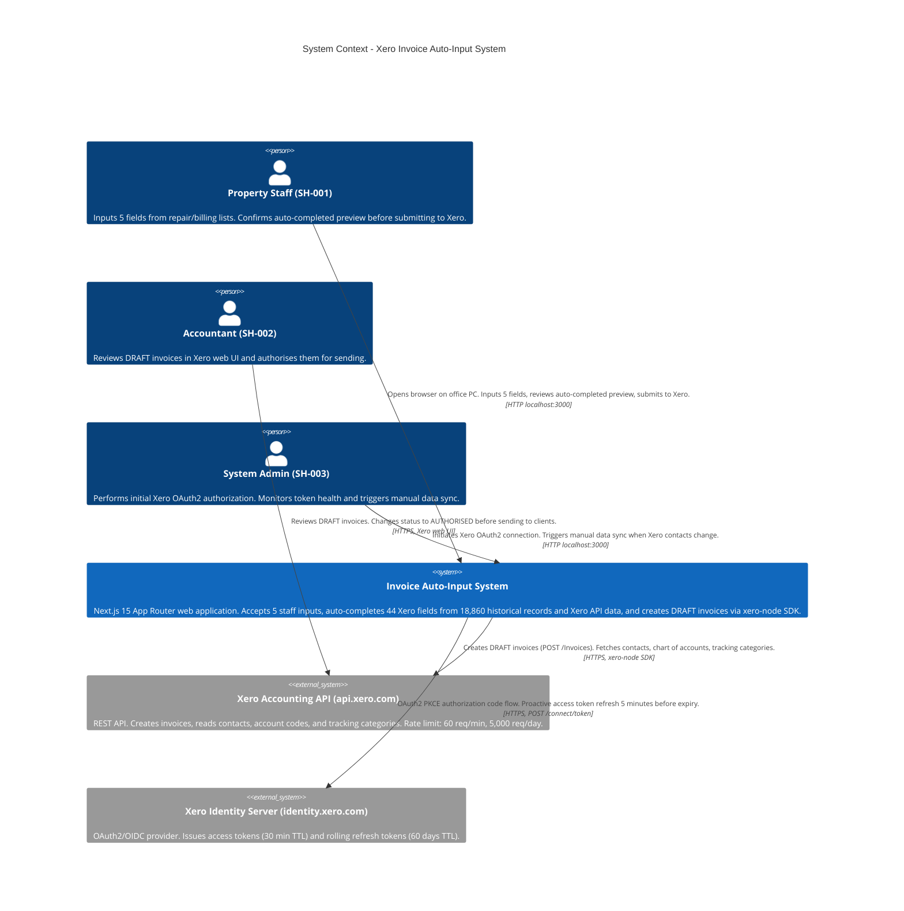
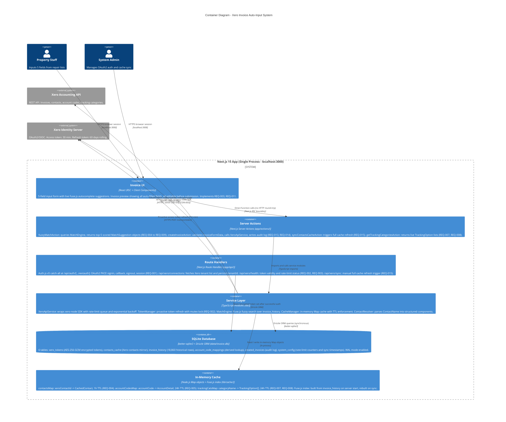
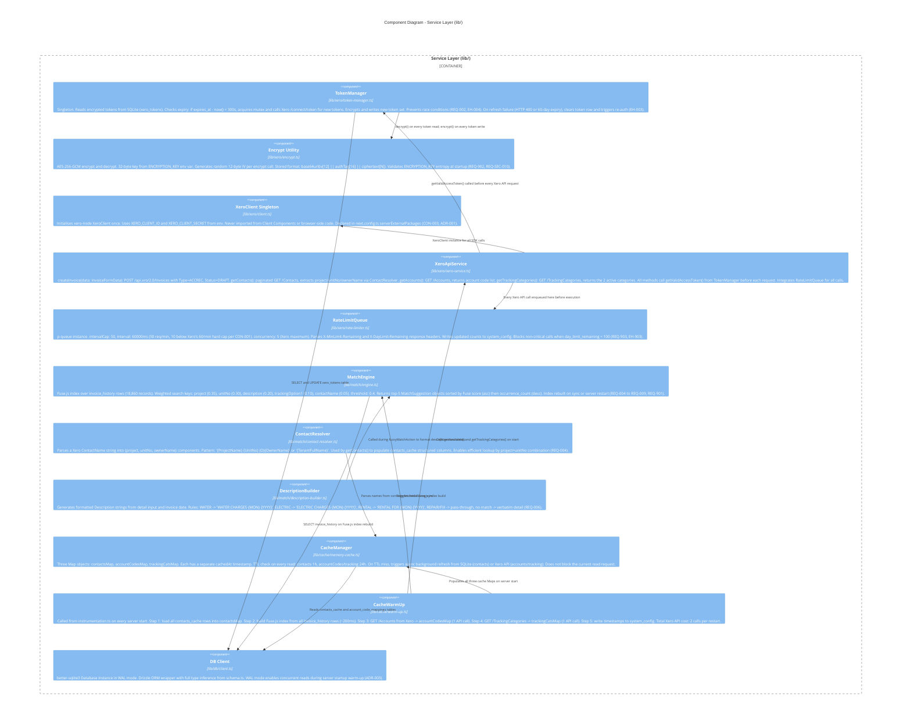
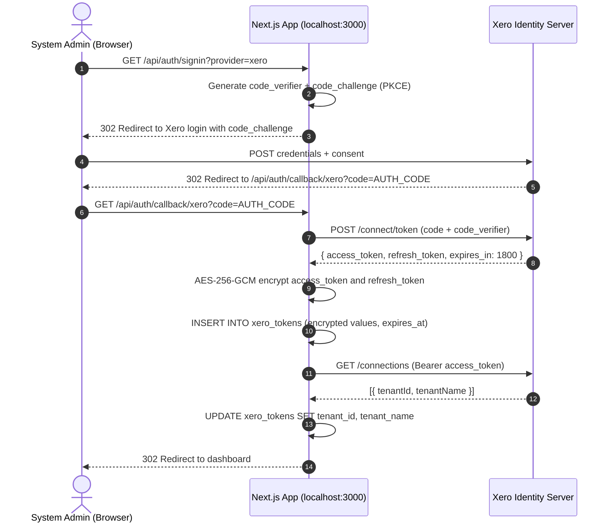
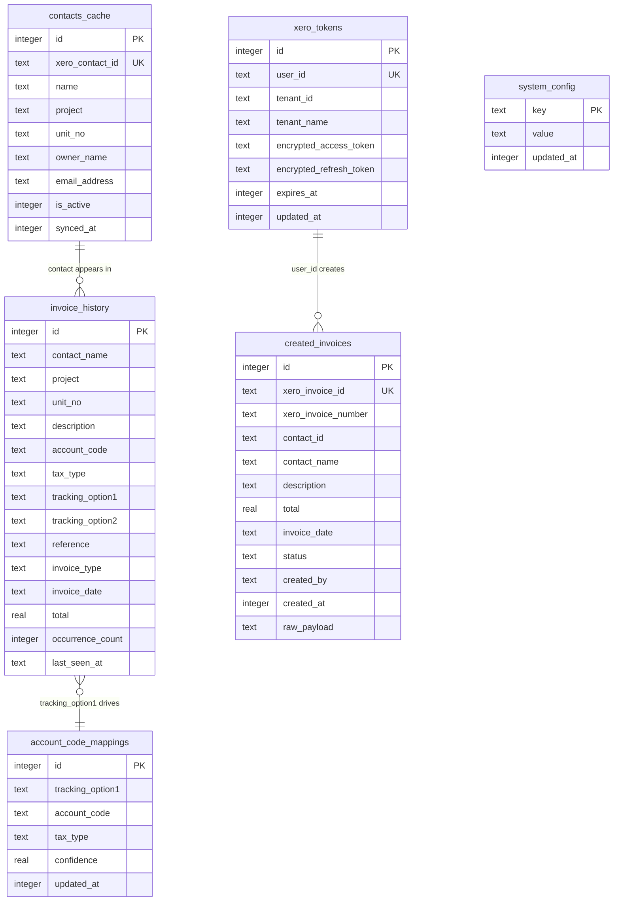
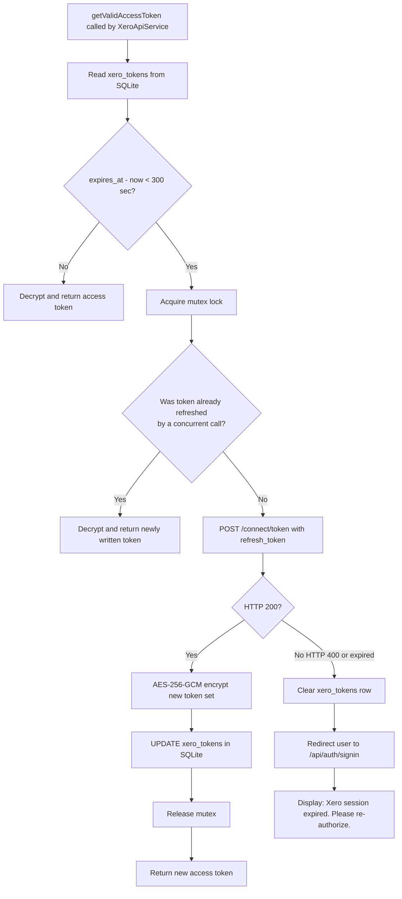
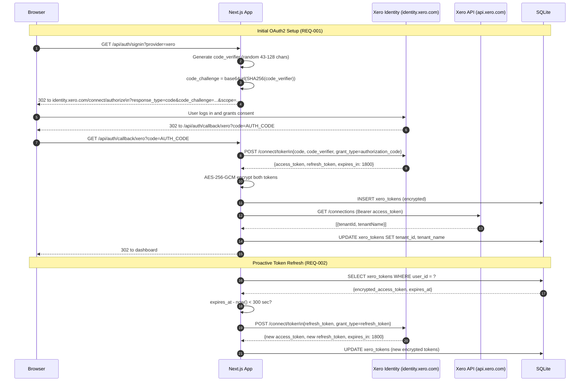
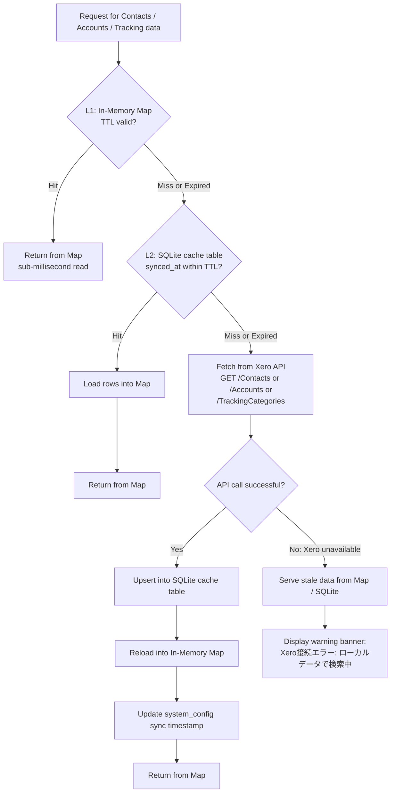
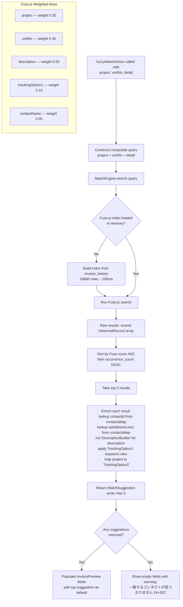
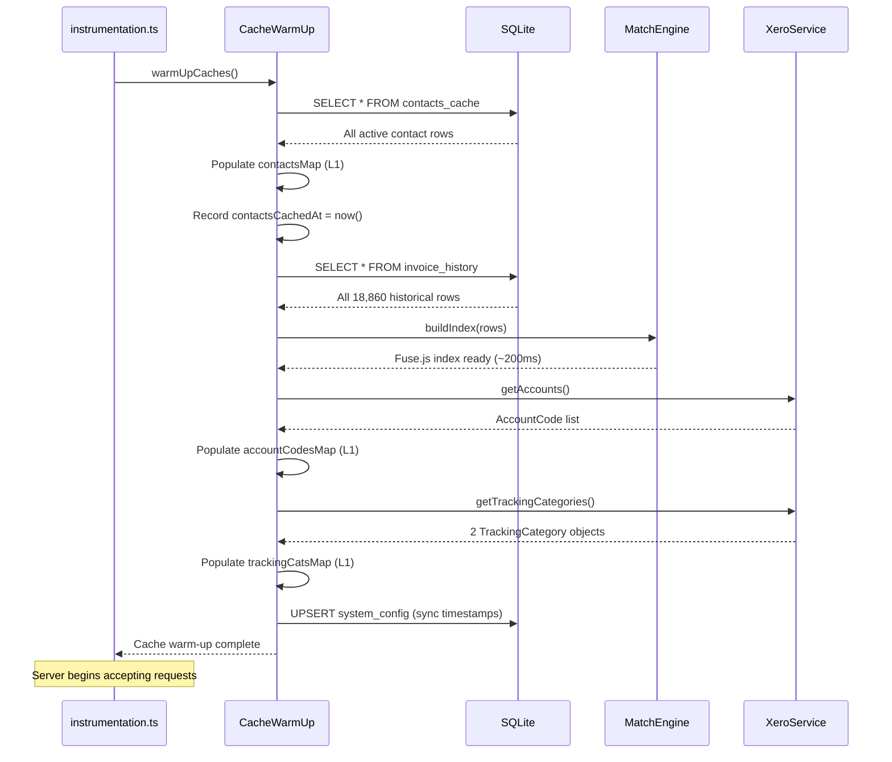

# Design: xero-invoice-auto-input

> Technical design document for the Xero Invoice Auto-Input System.
> Derived from: requirements.md, architecture_final.md, architecture.mermaid, threat-model.md
> Status: Draft | Date: 2026-03-10

---

## Table of Contents

- [System Overview](#system-overview)
- [1. C4 Model](#1-c4-model)
  - [1.1 Level 1: System Context](#11-level-1-system-context)
  - [1.2 Level 2: Container Diagram](#12-level-2-container-diagram)
  - [1.3 Level 3: Component Diagram](#13-level-3-component-diagram)
- [2. API Design](#2-api-design)
  - [2.1 Route Handlers](#21-route-handlers)
  - [2.2 Server Actions](#22-server-actions)
  - [2.3 Type Definitions](#23-type-definitions)
  - [2.4 OAuth2 Callback Flow](#24-oauth2-callback-flow)
- [3. Data Model](#3-data-model)
  - [3.1 ER Diagram](#31-er-diagram)
  - [3.2 Table Specifications](#32-table-specifications)
  - [3.3 Drizzle ORM Schema](#33-drizzle-orm-schema)
- [4. Security Design](#4-security-design)
  - [4.1 OAuth2 Flow](#41-oauth2-flow)
  - [4.2 Token Encryption (AES-256-GCM)](#42-token-encryption-aes-256-gcm)
  - [4.3 Token Rotation Strategy](#43-token-rotation-strategy)
  - [4.4 Threat Model Summary](#44-threat-model-summary)
- [5. Integration Patterns](#5-integration-patterns)
  - [5.1 Xero OAuth2 Authorization Code Flow](#51-xero-oauth2-authorization-code-flow)
  - [5.2 Cache-Aside Pattern](#52-cache-aside-pattern)
  - [5.3 Fuzzy Matching Pipeline](#53-fuzzy-matching-pipeline)
- [6. Caching Strategy](#6-caching-strategy)
- [7. Auto-Completion Logic](#7-auto-completion-logic)
- [8. Error Handling Strategy](#8-error-handling-strategy)
- [9. Project Structure](#9-project-structure)
- [10. Requirements Traceability Matrix](#10-requirements-traceability-matrix)

---

## System Overview

The Xero Invoice Auto-Input System is an internal web application built for a Malaysian property management company based in Johor Bahru. The company manages approximately 25 residential and commercial properties and currently records invoices and debit notes manually in Xero — a process requiring entry of up to 44 fields per document, taking over 10 minutes per invoice.

**Core purpose:** Staff input 5 fields from a repair or billing list (Date, Project, Unit No, Detail, Final Price). The system auto-completes all remaining Xero invoice fields and creates a DRAFT invoice via the Xero API. The target is to reduce per-invoice entry time from 10+ minutes to under 2 minutes (REQ-003 through REQ-013).

**Historical data foundation:** 18,860 invoice records exported from Xero (January 2023 to December 2025, 38 CSV files) are loaded into SQLite and indexed with Fuse.js. These records power the auto-completion logic for ContactName, AccountCode, Description, TrackingOption1, TrackingOption2, and Reference fields.

**Auto-completed fields (from 5 staff inputs):**

| Staff Input | Auto-Completed From |
|-------------|---------------------|
| Date | DueDate (via Contact payment terms) |
| Project | TrackingOption2, partial ContactName match |
| Unit No | ContactName lookup, AccountCode, partial address |
| Detail | Description (pattern-formatted), TrackingOption1, Reference |
| Final Price | Quantity=1, UnitAmount=FinalPrice, TaxType=Tax Exempt, Currency=MYR |

**Technology stack:**

| Layer | Technology | Rationale |
|-------|-----------|-----------|
| Framework | Next.js 15 App Router (>= 15.2.3) | RSC + Server Actions eliminate separate API layer; CVE-2025-29927 patched |
| Language | TypeScript (strict mode) | Type safety across Drizzle schema, Xero payloads, Server Actions |
| Authentication | Auth.js v5 (custom Xero OIDC provider) | No built-in Xero provider exists; ADR-002 |
| Xero SDK | xero-node (server-side only) | Official typed SDK; webpack isolation via serverExternalPackages (CON-003, ADR-001) |
| Database | Drizzle ORM + better-sqlite3 | Lightweight, synchronous, type-safe; no external DB server needed (ADR-003) |
| Fuzzy Search | Fuse.js | Weighted multi-field approximate matching; 5.3M weekly downloads; Apache-2.0 |
| UI | Tailwind CSS + shadcn/ui | Rapid development; consistent design system |
| Rate Limiting | p-queue | Enforces 50 req/min cap and max 5 concurrent calls to Xero (REQ-903) |
| Token Encryption | Node.js `node:crypto` (built-in) | AES-256-GCM; zero external dependencies (REQ-902) |

**Deployment:** localhost:3000 (internal tool only, no external internet exposure, CON-006). Xero OAuth2 callbacks are handled via the locally accessible redirect URI configured in the Xero Developer Portal.

**Scale:** ~500 invoices/month, 5-10 concurrent staff users, single Xero tenant (ASM-005).

---

## 1. C4 Model

### 1.1 Level 1: System Context

This diagram shows the system and its three external actors. The Accountant (SH-002) interacts directly with Xero's web UI rather than this system — the system's output is a DRAFT invoice that the Accountant reviews and authorises in Xero.



### 1.2 Level 2: Container Diagram

All containers run within a single Next.js 15 process on localhost:3000. There is no separate backend service. xero-node SDK is confined to server-side containers only (CON-003).



### 1.3 Level 3: Component Diagram

This diagram details the Service Layer (`lib/`) — the core of the system's logic. All components in this layer are server-side only.



---

## 2. API Design

### 2.1 Route Handlers (app/api/)

Route Handlers are used only for OAuth2 flows and administrative operations. All invoice creation and data matching is handled via Server Actions to avoid unnecessary HTTP round-trips.

| Method | Path | Purpose | Auth Required | REQ |
|--------|------|---------|:---:|-----|
| GET/POST | `/api/auth/[...nextauth]` | Auth.js v5 catch-all: signin initiation, OAuth2 callback, signout, session introspection | No | REQ-001 |
| GET | `/api/xero/connections` | After OAuth callback: fetch Xero tenant list from `/connections`, persist tenantId and tenantName to xero_tokens row | Session | REQ-001 |
| GET | `/api/xero/health` | Returns current token validity, seconds until expiry, daily and per-minute API usage remaining from system_config | Session | REQ-002, REQ-903 |
| POST | `/api/xero/sync` | Manual trigger: re-fetches all contacts (paginated), chart of accounts, and tracking categories from Xero; refreshes all caches and SQLite tables | Session | REQ-015 |

**GET /api/xero/health — Response Schema:**

```typescript
type HealthResponse = {
  tokenValid: boolean;
  expiresInSeconds: number;       // seconds until current access token expires
  dayLimitRemaining: number;      // latest X-DayLimit-Remaining value from system_config
  minuteLimitRemaining: number;   // latest X-MinLimit-Remaining value from system_config
  lastContactsSyncAt: string | null;   // ISO timestamp from system_config
  lastAccountsSyncAt: string | null;
  lastTrackingSyncAt: string | null;
};
```

**POST /api/xero/sync — Response Schema:**

```typescript
type SyncResponse = {
  success: boolean;
  syncedContacts: number;         // number of contacts upserted into contacts_cache
  syncedAccounts: number;         // number of accounts loaded into accountCodesMap
  syncedTracking: number;         // number of tracking options loaded into trackingCatsMap
  errors: string[];               // non-fatal per-resource error messages
};
```

### 2.2 Server Actions (app/actions/)

Server Actions are called directly from Client Components as typed async functions. There is no HTTP overhead. All Server Actions require an active Auth.js session (REQ-SEC-004).

| Action | File | Input | Output | REQ |
|--------|------|-------|--------|-----|
| `fuzzyMatchAction` | `actions/match.ts` | `{ project: string, unitNo: string, detail: string }` | `MatchSuggestion[]` (max 5, score-ranked ascending) | REQ-004 to REQ-009 |
| `createInvoiceAction` | `actions/invoice.ts` | `InvoiceFormData` (full schema, see 2.3) | `CreateInvoiceResult` | REQ-013, REQ-014 |
| `syncContactsCacheAction` | `actions/sync.ts` | `void` | `{ synced: number }` | REQ-015 |
| `getTrackingCategoriesAction` | `actions/sync.ts` | `void` | `TrackingCategory[]` | REQ-007, REQ-008 |

### 2.3 Type Definitions

**MatchSuggestion** — one entry in the top-5 list returned by `fuzzyMatchAction`:

```typescript
type MatchSuggestion = {
  score: number;                  // Fuse.js score: 0 = perfect, 1 = no match (lower is better)
  contactName: string;            // full Xero ContactName string
  contactId: string;              // Xero ContactID UUID
  accountCode: string;            // e.g. "1003-1025" (REQ-005)
  trackingOption1: string;        // NATURE OF ACCOUNT value, e.g. "IN - REP" (REQ-007)
  trackingOption2: string;        // Categories/Projects value, e.g. "MP4" (REQ-008)
  description: string;            // formatted description string (REQ-006)
  reference: 'INVOICE' | 'DEBIT NOTE';  // REQ-009
  emailAddress: string;           // from contacts_cache
  saAddressLine1: string;         // property street address (REQ-010)
};
```

**InvoiceFormData** — complete payload for `createInvoiceAction` and rendered in `InvoicePreview.tsx` (REQ-011):

```typescript
type InvoiceFormData = {
  // Staff inputs: 5 mandatory fields (REQ-003)
  date: string;                   // "D/MM/YYYY" format, e.g. "3/02/2026"
  project: string;                // one of the 25 TrackingOption2 project names
  unitNo: string;                 // e.g. "17-07", "B-10-03", "31-09"
  detail: string;                 // free text from repair/billing list
  finalPrice: number;             // MYR, minimum 0.01 (EH-005)

  // Auto-filled fields, all editable in preview (REQ-011)
  contactId: string;              // Xero ContactID UUID
  contactName: string;            // full Xero ContactName (REQ-004)
  emailAddress: string;           // from contacts_cache
  saAddressLine1: string;         // property street address (REQ-010)
  dueDate: string;                // "D/MM/YYYY", calculated from Contact payment terms (REQ-012)
  reference: string;              // "INVOICE" | "DEBIT NOTE" (REQ-009)
  description: string;            // formatted line item description (REQ-006)
  accountCode: string;            // Xero account code, e.g. "1003-1025" (REQ-005)
  trackingOption1: string;        // NATURE OF ACCOUNT value (REQ-007)
  trackingOption2: string;        // Categories/Projects value (REQ-008)

  // Fixed values, not user-editable (REQ-016)
  taxType: 'Tax Exempt';          // all 18,860 historical records use this value (ASM-003)
  currency: 'MYR';                // Malaysian Ringgit only (ASM-003)
  quantity: 1.0000;               // single unit per invoice line
  invoiceType: 'ACCREC';          // Sales invoice (accounts receivable)
  status: 'DRAFT';                // always DRAFT on creation (ADR-004)
};
```

**CreateInvoiceResult** — success response from `createInvoiceAction`:

```typescript
type CreateInvoiceResult = {
  invoiceId: string;              // Xero-assigned UUID
  invoiceNumber: string;          // Xero-assigned, format "JJB26-XXXX" (ADR-005)
  xeroUrl: string;                // deep link to invoice in Xero web UI
};
```

**TrackingCategory** — used in `getTrackingCategoriesAction`:

```typescript
type TrackingCategory = {
  trackingCategoryId: string;     // Xero UUID
  name: string;                   // "NATURE OF ACCOUNT" or "Categories/Projects"
  options: TrackingOption[];
};

type TrackingOption = {
  trackingOptionId: string;
  name: string;                   // e.g. "IN - REP", "MP4"
};
```

### 2.4 OAuth2 Callback Flow

The Auth.js v5 catch-all handler processes the Xero PKCE authorization code exchange. The sequence below shows the full browser-to-server-to-Xero round trip (REQ-001).



---

## 3. Data Model

### 3.1 ER Diagram



### 3.2 Table Specifications

#### xero_tokens

Stores the Xero OAuth2 token set. One row per authenticated user/tenant pair. Tokens are stored exclusively in AES-256-GCM encrypted form — plaintext tokens never touch disk (REQ-902).

| Column | Type | Constraints | Description |
|--------|------|-------------|-------------|
| `id` | INTEGER | PK, AUTOINCREMENT | Internal row ID |
| `user_id` | TEXT | NOT NULL, UNIQUE | Auth.js session user ID (sub from Xero OIDC) |
| `tenant_id` | TEXT | NOT NULL | Xero organisation tenant ID from /connections |
| `tenant_name` | TEXT | NOT NULL, DEFAULT '' | Human-readable tenant name |
| `encrypted_access_token` | TEXT | NOT NULL | AES-256-GCM encrypted JWT, base64url encoded |
| `encrypted_refresh_token` | TEXT | NOT NULL | AES-256-GCM encrypted refresh token |
| `expires_at` | INTEGER | NOT NULL | Unix timestamp (seconds) of access token expiry |
| `updated_at` | INTEGER | NOT NULL, DEFAULT unixepoch() | Last write timestamp |

#### contacts_cache

Mirror of Xero Contacts API response. Refreshed every hour (TTL) or on manual sync. Used as the primary source for ContactName autocomplete and SAAddressLine1 lookup (REQ-004, REQ-010).

| Column | Type | Constraints | Description |
|--------|------|-------------|-------------|
| `id` | INTEGER | PK, AUTOINCREMENT | Internal row ID |
| `xero_contact_id` | TEXT | NOT NULL, UNIQUE | Xero ContactID UUID |
| `name` | TEXT | NOT NULL | Full contact name, e.g. "Suasana Iskandar 17-07 (O)JOHN TAN" |
| `project` | TEXT | DEFAULT '' | Project component extracted by ContactResolver |
| `unit_no` | TEXT | DEFAULT '' | Unit number component extracted by ContactResolver |
| `owner_name` | TEXT | DEFAULT '' | Owner name after "(O)" separator |
| `email_address` | TEXT | DEFAULT '' | Contact email address |
| `is_active` | INTEGER (boolean) | NOT NULL, DEFAULT 1 | 0 for ARCHIVED contacts in Xero |
| `synced_at` | INTEGER | NOT NULL, DEFAULT unixepoch() | Timestamp of last successful sync |

#### invoice_history

Bulk-imported from 38 Xero CSV export files (January 2023 to December 2025, 18,860 rows). Aggregated by unique (contactName, description, accountCode, trackingOption1) tuples. The `occurrence_count` column drives ranking in fuzzy match results (REQ-004 to REQ-009).

| Column | Type | Constraints | Description |
|--------|------|-------------|-------------|
| `id` | INTEGER | PK, AUTOINCREMENT | Internal row ID |
| `contact_name` | TEXT | NOT NULL | Full Xero contact name |
| `project` | TEXT | DEFAULT '' | Extracted project name |
| `unit_no` | TEXT | DEFAULT '' | Extracted unit number |
| `description` | TEXT | NOT NULL | Line item description text |
| `account_code` | TEXT | DEFAULT '' | Xero account code, e.g. "1003-1025" |
| `tax_type` | TEXT | DEFAULT '' | Always "Tax Exempt" in practice (ASM-003) |
| `tracking_option1` | TEXT | DEFAULT '' | NATURE OF ACCOUNT value (28 options) |
| `tracking_option2` | TEXT | DEFAULT '' | Categories/Projects value (25 options) |
| `reference` | TEXT | DEFAULT '' | "INVOICE" or "DEBIT NOTE" |
| `invoice_type` | TEXT | DEFAULT 'ACCREC' | Always "ACCREC" (Sales invoice) |
| `invoice_date` | TEXT | DEFAULT '' | Date string "D/MM/YYYY" |
| `total` | REAL | DEFAULT 0 | Invoice total in MYR |
| `occurrence_count` | INTEGER | NOT NULL, DEFAULT 1 | Number of times this pattern appeared in history |
| `last_seen_at` | TEXT | DEFAULT '' | Most recent invoice date for this pattern |

#### account_code_mappings

Derived lookup table mapping TrackingOption1 categories to their most commonly associated AccountCode. Seeded from invoice_history data analysis; updated on sync (REQ-005).

| Column | Type | Constraints | Description |
|--------|------|-------------|-------------|
| `id` | INTEGER | PK, AUTOINCREMENT | Internal row ID |
| `tracking_option1` | TEXT | NOT NULL | One of the 28 NATURE OF ACCOUNT values |
| `account_code` | TEXT | NOT NULL | Most frequently associated Xero account code |
| `tax_type` | TEXT | NOT NULL, DEFAULT 'Tax Exempt' | Always "Tax Exempt" (ASM-003) |
| `confidence` | REAL | NOT NULL, DEFAULT 1.0 | Ratio of occurrences for this mapping (0.0 to 1.0) |
| `updated_at` | INTEGER | NOT NULL, DEFAULT unixepoch() | Last recalculation timestamp |

#### created_invoices

Append-only audit log of every successful Xero invoice creation. Written immediately after receiving HTTP 200 from Xero (REQ-014). If the SQLite write fails, the Xero record is treated as the source of truth (EH-020). The application layer must never issue DELETE or UPDATE against this table (REQ-SEC-009).

| Column | Type | Constraints | Description |
|--------|------|-------------|-------------|
| `id` | INTEGER | PK, AUTOINCREMENT | Internal row ID |
| `xero_invoice_id` | TEXT | NOT NULL, UNIQUE | Xero-assigned InvoiceID UUID |
| `xero_invoice_number` | TEXT | NOT NULL | Xero-assigned number, e.g. "JJB26-5949" |
| `contact_id` | TEXT | NOT NULL | Xero ContactID of the billed contact |
| `contact_name` | TEXT | NOT NULL | Contact name at time of creation |
| `description` | TEXT | NOT NULL | Line item description |
| `total` | REAL | NOT NULL | Invoice total in MYR |
| `invoice_date` | TEXT | NOT NULL | Invoice date "D/MM/YYYY" |
| `status` | TEXT | NOT NULL | "DRAFT" on creation; "PENDING_XERO" if offline |
| `created_by` | TEXT | NOT NULL | Auth.js session user ID, email from Xero OIDC (REQ-SEC-002) |
| `created_at` | INTEGER | NOT NULL, DEFAULT unixepoch() | Creation Unix timestamp |
| `raw_payload` | TEXT | NOT NULL | Full JSON of InvoiceFormData submitted to Xero |

#### system_config

Key-value store for runtime configuration, rate-limit counters, and sync timestamps.

| Column | Type | Constraints | Description |
|--------|------|-------------|-------------|
| `key` | TEXT | PK | Config key name |
| `value` | TEXT | NOT NULL | Config value (integer string, ISO timestamp, or JSON) |
| `updated_at` | INTEGER | NOT NULL, DEFAULT unixepoch() | Last update Unix timestamp |

Pre-defined keys:

| Key | Format | Updated By |
|-----|--------|-----------|
| `contacts_last_synced_at` | Unix timestamp string | CacheWarmUp, syncContactsCacheAction |
| `accounts_last_synced_at` | Unix timestamp string | CacheWarmUp, POST /api/xero/sync |
| `tracking_last_synced_at` | Unix timestamp string | CacheWarmUp, POST /api/xero/sync |
| `day_limit_remaining` | Integer string | RateLimitQueue after each Xero API response |
| `min_limit_remaining` | Integer string | RateLimitQueue after each Xero API response |

### 3.3 Drizzle ORM Schema

The complete Drizzle ORM schema in `lib/db/schema.ts`. All table names and column names match the ER diagram above exactly.

```typescript
import { sqliteTable, integer, text, real } from 'drizzle-orm/sqlite-core';
import { sql } from 'drizzle-orm';

// OAuth2 token storage — one row per authenticated user/tenant (REQ-001, REQ-902)
export const xeroTokens = sqliteTable('xero_tokens', {
  id: integer('id').primaryKey({ autoIncrement: true }),
  userId: text('user_id').notNull().unique(),
  tenantId: text('tenant_id').notNull(),
  tenantName: text('tenant_name').notNull().default(''),
  encryptedAccessToken: text('encrypted_access_token').notNull(),
  encryptedRefreshToken: text('encrypted_refresh_token').notNull(),
  expiresAt: integer('expires_at').notNull(),
  updatedAt: integer('updated_at').notNull().default(sql`(unixepoch())`),
});

// Xero Contacts API mirror — refreshed on sync or 1h TTL expiry (REQ-004, REQ-010)
export const contactsCache = sqliteTable('contacts_cache', {
  id: integer('id').primaryKey({ autoIncrement: true }),
  xeroContactId: text('xero_contact_id').notNull().unique(),
  name: text('name').notNull(),
  project: text('project').default(''),
  unitNo: text('unit_no').default(''),
  ownerName: text('owner_name').default(''),
  emailAddress: text('email_address').default(''),
  isActive: integer('is_active', { mode: 'boolean' }).notNull().default(true),
  syncedAt: integer('synced_at').notNull().default(sql`(unixepoch())`),
});

// Historical invoice patterns — bulk-imported from 38 CSV files, 18,860 rows (REQ-004 to REQ-009)
export const invoiceHistory = sqliteTable('invoice_history', {
  id: integer('id').primaryKey({ autoIncrement: true }),
  contactName: text('contact_name').notNull(),
  project: text('project').default(''),
  unitNo: text('unit_no').default(''),
  description: text('description').notNull(),
  accountCode: text('account_code').default(''),
  taxType: text('tax_type').default(''),
  trackingOption1: text('tracking_option1').default(''),
  trackingOption2: text('tracking_option2').default(''),
  reference: text('reference').default(''),
  invoiceType: text('invoice_type').default('ACCREC'),
  invoiceDate: text('invoice_date').default(''),
  total: real('total').default(0),
  occurrenceCount: integer('occurrence_count').notNull().default(1),
  lastSeenAt: text('last_seen_at').default(''),
});

// Derived account code lookup — built from invoice_history analysis (REQ-005)
export const accountCodeMappings = sqliteTable('account_code_mappings', {
  id: integer('id').primaryKey({ autoIncrement: true }),
  trackingOption1: text('tracking_option1').notNull(),
  accountCode: text('account_code').notNull(),
  taxType: text('tax_type').notNull().default('Tax Exempt'),
  confidence: real('confidence').notNull().default(1.0),
  updatedAt: integer('updated_at').notNull().default(sql`(unixepoch())`),
});

// Append-only audit log of every Xero invoice creation (REQ-014, REQ-SEC-009)
export const createdInvoices = sqliteTable('created_invoices', {
  id: integer('id').primaryKey({ autoIncrement: true }),
  xeroInvoiceId: text('xero_invoice_id').notNull().unique(),
  xeroInvoiceNumber: text('xero_invoice_number').notNull(),
  contactId: text('contact_id').notNull(),
  contactName: text('contact_name').notNull(),
  description: text('description').notNull(),
  total: real('total').notNull(),
  invoiceDate: text('invoice_date').notNull(),
  status: text('status').notNull(),
  createdBy: text('created_by').notNull(),
  createdAt: integer('created_at').notNull().default(sql`(unixepoch())`),
  rawPayload: text('raw_payload').notNull(),
});

// Key-value runtime configuration and rate-limit tracking (REQ-903)
export const systemConfig = sqliteTable('system_config', {
  key: text('key').primaryKey(),
  value: text('value').notNull(),
  updatedAt: integer('updated_at').notNull().default(sql`(unixepoch())`),
});
```

---

## 4. Security Design

### 4.1 OAuth2 Flow (Auth.js v5 Custom OIDC Provider)

Xero has no built-in Auth.js provider. A custom OIDC provider is configured in `auth.ts` per ADR-002. Auth.js v5 applies PKCE by default. The Xero-specific requirement is that the `Xero-Tenant-Id` header must be included in every API call — this is obtained from the `/connections` endpoint after the token exchange and stored in `xero_tokens.tenant_id`.

OAuth scopes requested (valid until September 2027, ASM-001):

```
openid  profile  email  offline_access
accounting.transactions
accounting.contacts
accounting.settings
```

Scope migration plan: Replace `accounting.transactions` with the narrower `accounting.invoices` scope by July 2027 (REQ-SEC-007).

`auth.ts` configuration structure:

```typescript
// auth.ts — Auth.js v5 with custom Xero OIDC provider (ADR-002)
export const { handlers, auth, signIn, signOut } = NextAuth({
  providers: [
    {
      id: 'xero',
      name: 'Xero',
      type: 'oidc',
      issuer: 'https://identity.xero.com',
      clientId: process.env.XERO_CLIENT_ID,
      clientSecret: process.env.XERO_CLIENT_SECRET,
      authorization: {
        params: {
          scope: 'openid profile email offline_access accounting.transactions accounting.contacts accounting.settings',
          response_type: 'code',
        },
      },
    },
  ],
  session: {
    strategy: 'jwt',
    maxAge: 30 * 60,   // 30 minutes session idle timeout (REQ-SEC-001)
  },
  callbacks: {
    async jwt({ token, account }) {
      if (account) {
        // Encrypt and persist full token set to SQLite on first sign-in
        await persistEncryptedTokenSet(token.sub!, account);
      }
      return token;
    },
  },
});
```

### 4.2 Token Encryption (AES-256-GCM)

All OAuth tokens are encrypted before writing to SQLite and decrypted exclusively within the server process in memory (REQ-902). The plaintext token string never reaches the filesystem.

Encryption scheme:

```
ENCRYPTION_KEY (32-byte hex from .env.local)
          |
    AES-256-GCM cipher
          |
   random 12-byte IV (generated fresh per encrypt call)
          |
   ciphertext + 16-byte GCM authentication tag
          |
   base64url encode: IV[12] || authTag[16] || ciphertext[N]
          |
   stored in SQLite encrypted_access_token / encrypted_refresh_token columns
```

Startup validation (EH-902, EH-904): On server start, all four required environment variables are checked. If any are absent or if ENCRYPTION_KEY is shorter than 32 bytes, the server aborts with a descriptive error message before accepting any requests (REQ-SEC-010):

```
Missing required environment variable: XERO_CLIENT_ID
Missing required environment variable: XERO_CLIENT_SECRET
Missing required environment variable: ENCRYPTION_KEY (must be 32-byte hex)
Missing required environment variable: NEXTAUTH_SECRET
```

### 4.3 Token Rotation Strategy

The TokenManager implements proactive refresh with a mutex to prevent the race condition where two concurrent requests both attempt a token refresh simultaneously (REQ-002, EH-004).



Refresh token failure handling (EH-003): If the Xero `/connect/token` endpoint returns HTTP 400 or the 60-day rolling window has lapsed, the system clears the `xero_tokens` row and redirects the user to re-authenticate. No token is left in a partially-refreshed state.

### 4.4 Threat Model Summary

Full STRIDE analysis is documented in `threat-model.md`. The table below summarises the design-level controls applied in this document.

| Threat (STRIDE) | Risk Level | Control in This Design | REQ |
|----------------|:----------:|------------------------|-----|
| OAuth token stored in plaintext | HIGH | AES-256-GCM encryption; plaintext never written to disk | REQ-902 |
| Repudiation — staff denies creating invoice | HIGH | Audit log captures user_id (Xero OIDC email), timestamp, raw payload | REQ-014, REQ-SEC-002 |
| Xero API rate limit exhaustion | HIGH | p-queue 50 req/min cap; daily guard at 4,500; exponential backoff on 429 | REQ-903 |
| Credentials leaked via source code or logs | HIGH | .env.local + .gitignore; startup validation; structured logging allowlist | REQ-904, REQ-SEC-006 |
| Concurrent token refresh race condition | MEDIUM | Mutex lock in TokenManager; double-check after lock acquisition | REQ-002, EH-004 |
| Unauthorized invoice creation | MEDIUM | Auth.js session guard on all routes; DRAFT status; preview gate before submit | REQ-011, REQ-013, REQ-SEC-004 |
| OAuth scopes too broad | MEDIUM | Scope minimization documented; migration to granular scopes by Jul 2027 | REQ-SEC-007 |
| SQLite file exposure (PII, encrypted tokens) | MEDIUM | OS chmod 600; tokens encrypted; localhost-only access | REQ-SEC-008 |
| XSS token theft | LOW | localhost-only deployment; Next.js default CSP; HttpOnly + SameSite=Strict cookies | CON-006 |
| SQL injection | LOW | Drizzle ORM parameterized queries exclusively; no raw SQL in application code | ADR-003 |

---

## 5. Integration Patterns

### 5.1 Xero OAuth2 Authorization Code Flow

The system uses the OAuth2 authorization code flow with PKCE. This is the only interaction pattern that involves browser redirects to an external system. All subsequent Xero API calls are server-to-server, proxied through Server Actions and the Service Layer.



### 5.2 Cache-Aside Pattern

The system implements cache-aside (lazy loading) for Xero reference data. On every read, the Service Layer checks the in-memory Map first, then falls back to SQLite, then to the Xero API. This pattern minimises API calls against Xero's 60 req/min rate limit (CON-001) while ensuring data freshness.



TTL policy per data type:

| Data | L1 In-Memory TTL | L2 SQLite TTL | Xero API Calls per Refresh |
|------|:---:|:---:|:---:|
| Contacts | 1 hour | synced_at column | N (paginated, ~1 per 100 contacts) |
| Account Codes | 24 hours | updated_at column | 1 |
| Tracking Categories | 24 hours | updated_at column | 1 |

### 5.3 Fuzzy Matching Pipeline

The fuzzy matching pipeline runs entirely in-process with no external API calls. It executes within `fuzzyMatchAction` on every keystroke debounce and must complete within 500ms (REQ-901).



Field derivation rules applied in the enrichment step:

| Target Field | Source | Fallback on No Match |
|-------------|--------|---------------------|
| ContactName | Fuse.js top result contactName + contacts_cache lookup | Manual entry field (EH-007) |
| AccountCode | invoice_history occurrence_count ranking for project+unitNo | Full account dropdown (EH-009) |
| Description | DescriptionBuilder pattern rules on `detail` + date | `detail` value verbatim (EH-010) |
| TrackingOption1 | Keyword pattern matching on `detail` | Empty + 28-option dropdown (EH-011) |
| TrackingOption2 | Direct project name lookup in trackingCatsMap (25 values) | Empty + dropdown (EH-012) |
| Reference | Keyword rules: REPAIR/FIX -> INVOICE; RENTAL/WATER/ELECTRIC -> DEBIT NOTE | "INVOICE" default (EH-013) |
| DueDate | Xero Contact paymentTerms days added to InvoiceDate | InvoiceDate = DueDate (EH-016) |
| SAAddressLine1 | contactsMap[contactId].saAddressLine1 | Empty field (EH-014) |

---

## 6. Caching Strategy

### Cache Layers

Two complementary cache layers achieve the 500ms autocomplete response target (REQ-901) while minimising Xero API calls (CON-001):

| Layer | Technology | Read Latency | Purpose |
|-------|-----------|:---:|---------|
| L1: In-Memory | Node.js `Map` objects | < 1ms | Hot path reads for contacts, accounts, tracking |
| L2: SQLite | `contacts_cache`, `account_code_mappings` tables | < 5ms | Persistent cache that survives server restarts |
| Fuse.js Index | Built from `invoice_history` (18,860 rows) | ~200ms build, < 10ms search | Fuzzy matching over historical invoice patterns |

### TTL Policy

| Data | L1 TTL | Invalidation Triggers | REQ |
|------|:------:|-----------------------|-----|
| Xero Contacts | 1 hour | Manual sync button, server restart warm-up | REQ-004, REQ-015 |
| Account Codes | 24 hours | Manual `/api/xero/sync` call | REQ-005, REQ-015 |
| Tracking Categories | 24 hours | Manual `/api/xero/sync` call | REQ-007, REQ-008, REQ-015 |
| Fuse.js Index | Until sync or restart | contacts_cache update, server restart | REQ-004, REQ-901 |
| Access Token | N/A (SQLite only) | Proactive refresh at T-5 min | REQ-002 |
| Refresh Token | N/A (SQLite only, 60-day rolling) | Replaced on each use | REQ-002 |

### Cache Warm-Up Sequence

On every server start, `instrumentation.ts` triggers the following sequence. Total Xero API cost: 2 calls per server restart. Fuse.js index build: approximately 200ms for 18,860 rows.



If Xero API calls fail during warm-up (network unavailable), the server continues with L2 SQLite data only. A warning banner is displayed in the UI: "Xero接続エラー: ローカルデータで検索中" (EH-008, EH-021).

### Memory Cache Implementation

```typescript
// lib/cache/memory-cache.ts
export const CACHE_TTL = {
  contacts:     60 * 60 * 1000,        // 1 hour in ms
  accountCodes: 24 * 60 * 60 * 1000,   // 24 hours in ms
  tracking:     24 * 60 * 60 * 1000,   // 24 hours in ms
} as const;

// contactsMap: key = xeroContactId, value = CachedContact
const contactsMap     = new Map<string, CachedContact>();
// accountCodesMap: key = accountCode string (e.g. "1003-1025"), value = AccountDetail
const accountCodesMap = new Map<string, AccountDetail>();
// trackingCatsMap: key = category name, value = TrackingOption[]
const trackingCatsMap = new Map<string, TrackingOption[]>();

let contactsCachedAt     = 0;
let accountCodesCachedAt = 0;
let trackingCachedAt     = 0;
```

---

## 7. Auto-Completion Logic

### Input Processing

Staff inputs `{ project, unitNo, detail }` into the 5-field form. The MatchEngine constructs a composite query string:

```
query = `${project} ${unitNo} ${detail}`
```

This composite is passed to Fuse.js, which searches the `invoice_history` index across five weighted fields.

### Fuse.js Configuration

```typescript
const fuseOptions: Fuse.IFuseOptions<HistoricalRecord> = {
  keys: [
    { name: 'project',         weight: 0.35 },
    { name: 'unitNo',          weight: 0.30 },
    { name: 'description',     weight: 0.20 },
    { name: 'trackingOption1', weight: 0.10 },
    { name: 'contactName',     weight: 0.05 },
  ],
  threshold: 0.4,          // 0 = exact, 1 = match anything; 0.4 allows minor typos
  includeScore: true,
  minMatchCharLength: 2,
  useExtendedSearch: false,
};
```

### Suggestion Ranking

Results are sorted by Fuse.js score ascending (lower = better match), then by `occurrence_count` descending for equal-score ties. Top 5 are returned as `MatchSuggestion[]`.

### Description Generation Rules (REQ-006)

| Detail keyword | Output pattern | Example output |
|---------------|----------------|----------------|
| WATER | `WATER CHARGES {MON} {YYYY}` | "WATER CHARGES FEB 2026" |
| ELECTRIC | `ELECTRIC CHARGES {MON} {YYYY}` | "ELECTRIC CHARGES FEB 2026" |
| RENTAL or RENT | `RENTAL FOR {MON} {YYYY}` | "RENTAL FOR MAR 2026" |
| REPAIR, REP, or FIX | Pass-through from detail | "COOKER HOOD REPAIR" |
| No keyword match | Verbatim `detail` text | (EH-010) |

### TrackingOption1 Classification Rules (REQ-007)

| Detail keyword pattern | Auto-selected TrackingOption1 |
|------------------------|-------------------------------|
| REPAIR, REP, FIX | IN - REP |
| REQUEST, REQ | IN - REQ |
| RENTAL, RENT | (IN) - ROB |
| WATER CHARGES, ELECTRIC, UTILITY | (IN) - ROB |
| CLEANING | IN - Cleaning Services |
| RENOVATION, RENO | IN - Renovation |
| No pattern match | Empty — staff selects from 28-option dropdown (EH-011) |

---

## 8. Error Handling Strategy

### Xero API Error Responses

| HTTP Status | Cause | User Message | System Action | REQ |
|:-----------:|-------|-------------|---------------|-----|
| 400 | Xero field validation error | Display Xero error text; highlight offending field in preview | Log raw Xero error payload to structured logger | REQ-013 EH-017 |
| 401 | Access token expired or revoked | Redirect to Xero re-authorization | Clear stale xero_tokens row; invoke signIn | REQ-002 EH-003, REQ-013 EH-019 |
| 429 | Rate limit exceeded | "Xeroのレート制限に達しました。2分後に再試行してください。" | Exponential backoff: 1s, 2s, 4s, 8s, 16s, max 5 attempts | REQ-013 EH-018, REQ-903 |
| 500 | Xero server error | "Xeroが利用不可能です。しばらくしてから再試行してください。" | Retry 3 times with 5-second intervals | REQ-013 |

### Exponential Backoff on HTTP 429 (REQ-013 EH-018)

```
Attempt 1: immediate
Attempt 2: wait 1 second
Attempt 3: wait 2 seconds
Attempt 4: wait 4 seconds
Attempt 5: wait 8 seconds
After 5 failures: surface error to user. No further automatic retry.
```

### Offline Graceful Degradation

If the Xero API is unreachable when `createInvoiceAction` is invoked:

1. Save `InvoiceFormData` as JSON to `created_invoices` with `status = 'PENDING_XERO'`.
2. Display: "インボイスをローカルに保存しました。接続が回復したら自動送信されます。"
3. A background retry job (every 5 minutes) attempts to re-submit all `PENDING_XERO` records.

### Autocomplete Error States

| Error Condition | UI Behavior | REQ |
|----------------|------------|-----|
| No ContactName match found | Show warning: "一致するコンタクトが見つかりません。手動で入力してください。" Manual input field shown. | REQ-004 EH-007 |
| Xero Contacts API unavailable during search | Show banner: "Xero接続エラー: ローカルデータで検索中". Continue with SQLite contacts_cache. | REQ-004 EH-008 |
| No AccountCode match | Show empty AccountCode field with full chart-of-accounts dropdown | REQ-005 EH-009 |
| No Description pattern match | Set Description to verbatim `detail` input value | REQ-006 EH-010 |
| TrackingOption1 not determinable | Show empty field with 28-option dropdown | REQ-007 EH-011 |
| TrackingOption2 project not found in 25 options | Show empty field with dropdown | REQ-008 EH-012 |
| Reference not determinable | Default to "INVOICE", staff can change to "DEBIT NOTE" | REQ-009 EH-013 |

---

## 9. Project Structure

```
/                                     -- Next.js 15 project root
├── app/
│   ├── page.tsx                      -- Dashboard / invoice input page (RSC)
│   ├── layout.tsx                    -- Root layout with Auth.js SessionProvider
│   ├── actions/
│   │   ├── match.ts                  -- fuzzyMatchAction (REQ-004 to REQ-009)
│   │   ├── invoice.ts                -- createInvoiceAction (REQ-013, REQ-014)
│   │   └── sync.ts                   -- syncContactsCacheAction, getTrackingCategoriesAction (REQ-015, REQ-007)
│   ├── api/
│   │   ├── auth/[...nextauth]/
│   │   │   └── route.ts              -- Auth.js v5 catch-all (REQ-001, ADR-002)
│   │   └── xero/
│   │       ├── connections/route.ts  -- GET: fetch and save tenantId after auth
│   │       ├── health/route.ts       -- GET: token validity and rate-limit status (REQ-002, REQ-903)
│   │       └── sync/route.ts         -- POST: manual cache sync trigger (REQ-015)
│   └── components/
│       ├── InvoiceForm.tsx            -- 5-field input with debounced autocomplete (Client Component, REQ-003)
│       ├── InvoicePreview.tsx         -- Full editable preview of all 44 fields (Client Component, REQ-011)
│       ├── SuggestionList.tsx         -- Top-5 match dropdown (REQ-004)
│       └── StatusToast.tsx            -- Success/error toast notifications
│
├── lib/
│   ├── xero/
│   │   ├── client.ts                 -- XeroClient singleton; server-side only (ADR-001, CON-003)
│   │   ├── token-manager.ts          -- Proactive refresh + mutex lock (REQ-002)
│   │   ├── xero-service.ts           -- All Xero API calls (REQ-013, REQ-015)
│   │   ├── rate-limiter.ts           -- p-queue 50 req/min, 5 concurrent (REQ-903)
│   │   └── encrypt.ts                -- AES-256-GCM encrypt / decrypt (REQ-902)
│   ├── match/
│   │   ├── engine.ts                 -- Fuse.js MatchEngine (REQ-004 to REQ-009, REQ-901)
│   │   ├── contact-resolver.ts       -- Parse ContactName into {project, unitNo, ownerName}
│   │   └── description-builder.ts    -- Description pattern generation (REQ-006)
│   ├── cache/
│   │   ├── memory-cache.ts           -- In-memory Maps + TTL logic (REQ-004, REQ-005, REQ-007, REQ-008)
│   │   └── warm-up.ts                -- Server-start cache initialization
│   └── db/
│       ├── schema.ts                 -- Drizzle ORM schema for all 6 tables (ADR-003)
│       ├── client.ts                 -- better-sqlite3 + Drizzle instance (WAL mode)
│       └── migrations/               -- Drizzle Kit generated SQL migration files
│
├── data/
│   ├── invoice.db                    -- SQLite database file (gitignored)
│   ├── field_reference.json          -- Xero field reference data (fixed values, REQ-016)
│   └── tracking_options.json         -- TrackingOption1 (28) and TrackingOption2 (25) full lists
│
├── auth.ts                           -- Auth.js v5 config (custom Xero OIDC provider, ADR-002)
├── instrumentation.ts                -- Next.js instrumentation hook (cache warm-up on server start)
├── next.config.ts                    -- serverExternalPackages: ['xero-node', 'better-sqlite3'] (CON-003)
├── .env.local                        -- XERO_CLIENT_ID, XERO_CLIENT_SECRET, ENCRYPTION_KEY, NEXTAUTH_SECRET
├── .env.example                      -- Template with placeholder values (committed to git)
└── .gitignore                        -- Includes: .env*, data/invoice.db
```

---

## 10. Requirements Traceability Matrix

Maps every requirement to its primary design component and document section.

| REQ ID | Requirement Summary | Primary Design Component | Section |
|--------|---------------------|--------------------------|---------|
| REQ-001 | Xero OAuth2 authentication | Auth.js v5 custom OIDC provider; `/api/auth/[...nextauth]`; `xero_tokens` table | 2.4, 4.1, 5.1 |
| REQ-002 | Automatic token refresh (mutex, T-5 min) | `TokenManager` in `lib/xero/token-manager.ts`; mutex lock; proactive refresh flow | 4.3, 5.1 |
| REQ-003 | 5-field input form | `InvoiceForm.tsx` Client Component; `InvoiceFormData` type; validation rules EH-005, EH-006 | 2.3 |
| REQ-004 | ContactName autocomplete (top-5, 1h TTL cache) | `MatchEngine` (Fuse.js); `contacts_cache` table; `contactsMap` L1 cache | 5.3, 6, 7 |
| REQ-005 | AccountCode autocomplete (highest frequency) | `invoice_history` occurrence_count ranking; `account_code_mappings` table | 3.2, 7 |
| REQ-006 | Description autocomplete (pattern matching) | `DescriptionBuilder` in `lib/match/description-builder.ts` | 7 |
| REQ-007 | TrackingOption1 autocomplete (28 options, 24h TTL) | `MatchEngine` keyword classification rules; `trackingCatsMap` L1 cache | 7, 6 |
| REQ-008 | TrackingOption2 autocomplete (project mapping, 24h TTL) | Direct project-to-TrackingOption2 mapping; `trackingCatsMap` L1 cache | 7, 6 |
| REQ-009 | Reference auto-determination (INVOICE / DEBIT NOTE) | Keyword rules in `MatchEngine`; field_reference.json | 7 |
| REQ-010 | SAAddressLine1 from ContactName | `contactsMap[contactId].saAddressLine1` lookup | 7 |
| REQ-011 | Invoice preview (all fields editable) | `InvoicePreview.tsx` Client Component; `InvoiceFormData` type (all fields) | 2.3 |
| REQ-012 | DueDate auto-calculation (Contact payment terms) | `xeroService.getContacts()` paymentTerms; fallback = InvoiceDate (EH-016) | 7 |
| REQ-013 | Xero DRAFT invoice creation | `createInvoiceAction`; `XeroApiService.createInvoice()`; exponential backoff | 2.2, 2.3, 8 |
| REQ-014 | Invoice creation audit log | `created_invoices` table; written in `createInvoiceAction` after Xero HTTP 200 | 3.2, 3.3 |
| REQ-015 | Manual cache sync | `syncContactsCacheAction`; `POST /api/xero/sync`; CacheManager TTL invalidation | 2.1, 2.2, 6 |
| REQ-016 | Fixed values (TaxType, Currency, Quantity, Type) | Hardcoded in `InvoiceFormData` type literals; `status: 'DRAFT'` | 2.3 |
| REQ-901 | Autocomplete response P95 <= 500ms | In-memory Fuse.js index; `contactsMap` L1 cache; Server Action direct call (no HTTP overhead) | 6, 7 |
| REQ-902 | AES-256-GCM token encryption | `lib/xero/encrypt.ts`; `encrypted_access_token` / `encrypted_refresh_token` columns | 4.2, 3.2 |
| REQ-903 | Xero API rate limiting (50 req/min, 4,500 req/day cap) | `lib/xero/rate-limiter.ts` (p-queue); `system_config` day_limit_remaining tracking | 2.1, 1.3 |
| REQ-904 | Credential protection (env vars only, no source code / logs) | `.env.local` + `.gitignore`; startup env-var validation; structured logging allowlist | 4.2, 9 |
| REQ-SEC-001 | Session idle timeout 30 minutes | `session.maxAge: 30 * 60` in `auth.ts` | 4.1 |
| REQ-SEC-002 | Audit log includes Xero OIDC user identity | `created_by` column stores Auth.js session sub (Xero email) | 3.2 |
| REQ-SEC-004 | Auth.js session validation on all Xero-facing routes | Session check middleware applied to all `/api/xero/*` and Server Actions | 4.4 |
| REQ-SEC-006 | Structured logging with field allowlist; redact tokens | Logging wrapper in `lib/xero/xero-service.ts`; no token values in any log output | 4.4 |
| REQ-SEC-007 | Migrate to granular OAuth scopes by Jul 2027 | Scope migration plan documented in Section 4.1 | 4.1 |
| REQ-SEC-008 | SQLite file permissions set to 600 | Deployment step: `chmod 600 data/invoice.db` | 4.4 |
| REQ-SEC-009 | Append-only audit log (no DELETE / UPDATE at app layer) | `createdInvoices` table has no delete method exposed in service layer | 3.2 |
| REQ-SEC-010 | Validate ENCRYPTION_KEY entropy at startup | Startup check in `lib/xero/encrypt.ts` validates key is >= 32 bytes | 4.2 |
| ASM-001 | Broad OAuth scopes valid until Sep 2027 | Scope list in `auth.ts`; migration plan in Section 4.1 | 4.1 |
| ASM-003 | All invoices are Tax Exempt, MYR | Fixed type literals in `InvoiceFormData`; REQ-016 | 2.3 |
| ASM-006 | xero-node server-side only | `serverExternalPackages` in `next.config.ts`; `lib/xero/` never imported from Client Components | 9 |
| CON-001 | Rate limit: 60 req/min, 5,000 req/day | p-queue 50/min cap; daily limit guard at 4,500 in RateLimitQueue | 1.3, 5.2 |
| CON-002 | Access token 30 min, refresh token 60 days rolling | `expires_at` column; T-5 min proactive refresh in TokenManager | 4.3, 3.2 |
| CON-003 | xero-node requires fs, server-side only | `serverExternalPackages: ['xero-node', 'better-sqlite3']` in `next.config.ts` | 1.2, 9 |
| CON-006 | localhost:3000 only, no external exposure | No HTTPS required; Auth.js NEXTAUTH_URL=http://localhost:3000 | 1.1 |
| ADR-001 | Use xero-node SDK (not raw REST fetch) | `lib/xero/client.ts` XeroClient singleton | 1.3 |
| ADR-002 | Auth.js v5 custom Xero OIDC provider | `auth.ts` configuration; `/api/auth/[...nextauth]` route handler | 4.1 |
| ADR-003 | Drizzle ORM + better-sqlite3 | `lib/db/schema.ts`; `lib/db/client.ts`; all 6 table definitions | 3.3 |
| ADR-004 | DRAFT status on invoice creation | `status: 'DRAFT'` as const in `InvoiceFormData`; REQ-016 | 2.3 |
| ADR-005 | InvoiceNumber assigned by Xero, not specified in POST | No `InvoiceNumber` in POST payload; read from Xero response object | 2.2 |

---

*End of design.md*
*Version 1.1 | 2026-03-10 | Status: Draft*
