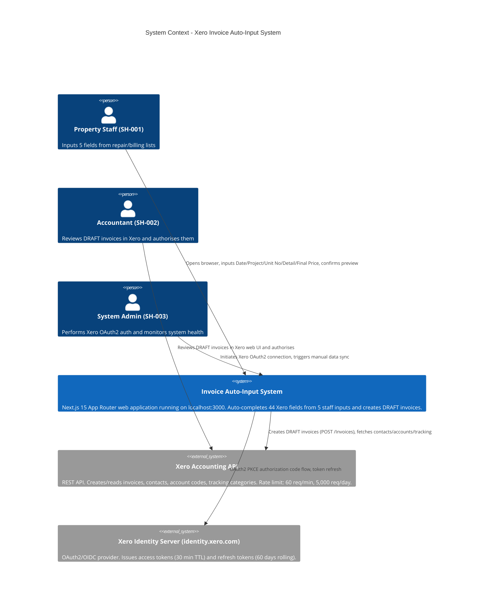
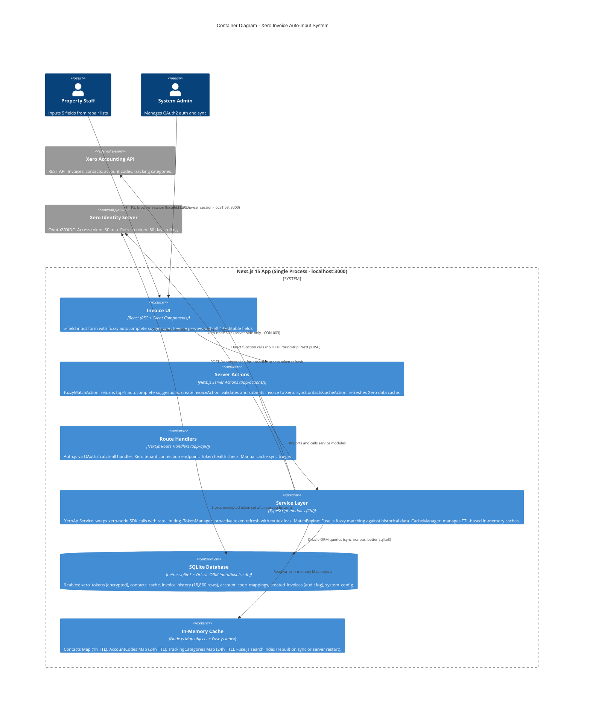
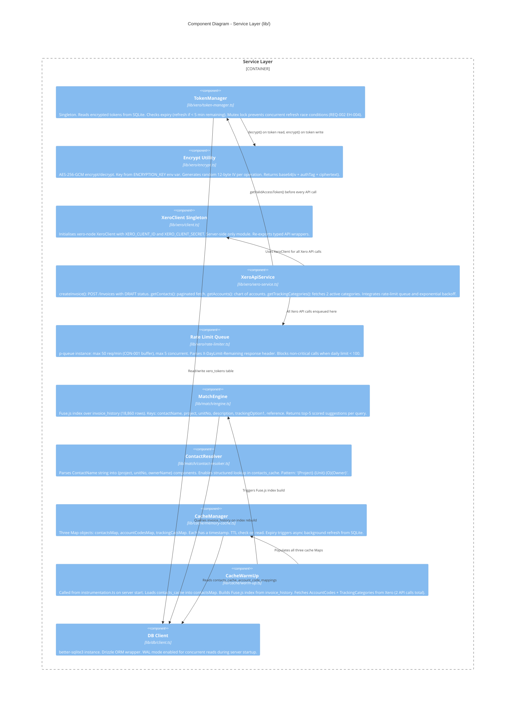

# Design: xero-invoice-auto-input

> Technical design document for the Xero Invoice Auto-Input System.
> Derived from: requirements.md, architecture_final.md, architecture.mermaid, field_reference.json, tracking_options.json
> Status: Draft | Date: 2026-03-10

---

## Table of Contents

1. [Executive Summary](#1-executive-summary)
2. [C4 Architecture Model](#2-c4-architecture-model)
   - 2.1 Level 1: System Context
   - 2.2 Level 2: Container Diagram
   - 2.3 Level 3: Component Diagram
3. [API Design](#3-api-design)
   - 3.1 Route Handlers
   - 3.2 Server Actions
   - 3.3 Type Definitions
4. [Data Model](#4-data-model)
   - 4.1 ER Diagram
   - 4.2 Table Specifications
5. [Security Design](#5-security-design)
   - 5.1 OAuth2 Flow
   - 5.2 Token Encryption (AES-256-GCM)
   - 5.3 Token Rotation
   - 5.4 Threat Model
6. [Caching Strategy](#6-caching-strategy)
   - 6.1 Cache Layers
   - 6.2 TTL Policy
   - 6.3 Cache Warm-Up
7. [Auto-Completion Logic](#7-auto-completion-logic)
8. [Error Handling Strategy](#8-error-handling-strategy)
9. [Project Structure](#9-project-structure)
10. [Requirements Traceability Matrix](#10-requirements-traceability-matrix)

---

## 1. Executive Summary

| Item | Value |
|------|-------|
| Architecture Style | Modular Monolith (Next.js 15 App Router) |
| Key Decision | Single deployable unit; xero-node SDK confined strictly to server-side (CON-003) |
| Target Scale | ~500 invoices/month, 5-10 concurrent staff users, single Xero tenant |
| Deployment | localhost:3000 (internal tool only, CON-006) |
| Timeline | 8 weeks to MVP (Phase 1) |
| Language | TypeScript (strict mode) |
| Database | SQLite via Drizzle ORM + better-sqlite3 |
| Key Libraries | xero-node v14.0.0, Auth.js v5, Fuse.js, p-queue |

The system reduces invoice creation time from 10+ minutes to under 2 minutes (REQ-003 through REQ-013) by auto-completing 44 Xero fields from 5 staff inputs, backed by 18,860 rows of historical invoice data.

---

## 2. C4 Architecture Model

### 2.1 Level 1: System Context



### 2.2 Level 2: Container Diagram



### 2.3 Level 3: Component Diagram (Service Layer)



---

## 3. API Design

### 3.1 Route Handlers (app/api/)

| Method | Path | Purpose | Auth Required | REQ |
|--------|------|---------|:---:|-----|
| GET/POST | `/api/auth/[...nextauth]` | Auth.js v5 catch-all: signin, callback, signout, session | No | REQ-001 |
| GET | `/api/xero/connections` | After OAuth callback: fetch Xero tenant list, persist tenantId to SQLite | Session | REQ-001 |
| GET | `/api/xero/health` | Returns token validity status, time-to-expiry, and daily API usage remaining | Session | REQ-002, REQ-903 |
| POST | `/api/xero/sync` | Manual trigger: re-fetches contacts, accounts, and tracking categories from Xero and refreshes all caches | Session | REQ-015 |

**GET /api/xero/health - Response Schema:**

```typescript
type HealthResponse = {
  tokenValid: boolean;
  expiresInSeconds: number;       // seconds until access token expires
  dayLimitRemaining: number;      // X-DayLimit-Remaining from last Xero call
  minuteLimitRemaining: number;   // X-MinLimit-Remaining from last Xero call
  lastSyncAt: string | null;      // ISO timestamp of last successful cache sync
};
```

**POST /api/xero/sync - Response Schema:**

```typescript
type SyncResponse = {
  success: boolean;
  syncedContacts: number;
  syncedAccounts: number;
  syncedTracking: number;
  errors: string[];               // non-fatal per-resource errors
};
```

### 3.2 Server Actions (app/actions/)

| Action | File | Input | Output | REQ |
|--------|------|-------|--------|-----|
| `fuzzyMatchAction` | `actions/match.ts` | `{ project: string, unitNo: string, detail: string }` | `MatchSuggestion[]` (max 5, score-ranked) | REQ-004 to REQ-009 |
| `createInvoiceAction` | `actions/invoice.ts` | `InvoiceFormData` (all fields, see below) | `{ invoiceId, invoiceNumber, xeroUrl }` | REQ-013, REQ-014 |
| `syncContactsCacheAction` | `actions/sync.ts` | none | `{ synced: number }` | REQ-015 |
| `getTrackingCategoriesAction` | `actions/sync.ts` | none | `TrackingCategory[]` | REQ-007, REQ-008 |

**MatchSuggestion type:**

```typescript
type MatchSuggestion = {
  score: number;                  // Fuse.js match score (lower = better)
  contactName: string;
  contactId: string;              // Xero ContactID (UUID)
  accountCode: string;
  trackingOption1: string;        // NATURE OF ACCOUNT value
  trackingOption2: string;        // Categories/Projects value
  description: string;            // suggested description text
  reference: 'INVOICE' | 'DEBIT NOTE';
  emailAddress: string;
  saAddressLine1: string;
};
```

**InvoiceFormData type (full schema for createInvoiceAction):**

```typescript
type InvoiceFormData = {
  // Staff inputs (5 mandatory fields - REQ-003)
  date: string;                   // format: "D/MM/YYYY" (e.g. "3/02/2026")
  project: string;                // one of 25 TrackingOption2 values
  unitNo: string;                 // e.g. "17-07", "B-10-03"
  detail: string;                 // free text from repair list
  finalPrice: number;             // MYR, >= 0.01 (EH-005)

  // Auto-filled fields (all editable by staff in preview - REQ-011)
  contactId: string;              // Xero ContactID UUID
  contactName: string;            // display name
  emailAddress: string;
  saAddressLine1: string;         // property street address (REQ-010)
  dueDate: string;                // format: "D/MM/YYYY" (REQ-012)
  reference: string;              // "INVOICE" | "DEBIT NOTE" (REQ-009)
  description: string;            // line item description (REQ-006)
  accountCode: string;            // Xero account code (REQ-005)
  trackingOption1: string;        // NATURE OF ACCOUNT (REQ-007)
  trackingOption2: string;        // Categories/Projects (REQ-008)

  // Fixed values (REQ-016)
  taxType: 'Tax Exempt';
  currency: 'MYR';
  quantity: 1.0000;
  invoiceType: 'ACCREC';
  status: 'DRAFT';
};
```

**createInvoiceAction - Success Response:**

```typescript
type CreateInvoiceResult = {
  invoiceId: string;              // Xero-assigned UUID
  invoiceNumber: string;          // Xero-assigned, format: "JJB26-XXXX"
  xeroUrl: string;                // deep link to invoice in Xero web UI
};
```

### 3.3 OAuth2 Callback Flow

The Auth.js v5 catch-all handler at `/api/auth/[...nextauth]` processes the Xero OAuth2 PKCE authorization code flow:

```
Browser                  Next.js App              Xero Identity
   |                         |                         |
   |-- GET /api/auth/signin ->|                         |
   |                         |-- redirect w/ code_challenge ->|
   |<-- 302 to Xero login ---|                         |
   |                         |                         |
   |-- POST credentials ----->|                         |
   |                         |<-- authorization code --|
   |                         |                         |
   |                         |-- POST /connect/token  ->|
   |                         |   (code + code_verifier) |
   |                         |<-- access_token +       |
   |                         |    refresh_token        |
   |                         |                         |
   |                         |-- AES-256-GCM encrypt --|
   |                         |-- INSERT xero_tokens ----|
   |                         |                         |
   |<-- 302 to dashboard ----|                         |
```

---

## 4. Data Model

### 4.1 ER Diagram


### 4.2 Table Specifications

#### xero_tokens
Stores the OAuth2 token set. One row per authenticated user/tenant pair. Tokens are always stored encrypted (REQ-902).

| Column | Type | Constraints | Description |
|--------|------|------------|-------------|
| `id` | INTEGER | PK, AUTOINCREMENT | Internal row ID |
| `user_id` | TEXT | NOT NULL, UNIQUE | Auth.js session user ID |
| `tenant_id` | TEXT | NOT NULL | Xero organisation tenant ID |
| `tenant_name` | TEXT | NOT NULL, DEFAULT '' | Human-readable tenant name |
| `encrypted_access_token` | TEXT | NOT NULL | AES-256-GCM encrypted JWT, base64 encoded |
| `encrypted_refresh_token` | TEXT | NOT NULL | AES-256-GCM encrypted refresh token |
| `expires_at` | INTEGER | NOT NULL | Unix timestamp (seconds) of access token expiry |
| `updated_at` | INTEGER | NOT NULL, DEFAULT unixepoch() | Last write timestamp |

#### contacts_cache
Mirror of Xero Contacts API response. Refreshed every 1 hour (TTL) or on manual sync trigger. Used as the source for ContactName autocomplete (REQ-004).

| Column | Type | Constraints | Description |
|--------|------|------------|-------------|
| `id` | INTEGER | PK, AUTOINCREMENT | Internal row ID |
| `xero_contact_id` | TEXT | NOT NULL, UNIQUE | Xero ContactID (UUID) |
| `name` | TEXT | NOT NULL | Full contact name (e.g. "Suasana Iskandar 17-07 (O)JOHN TAN") |
| `project` | TEXT | DEFAULT '' | Extracted project component from name |
| `unit_no` | TEXT | DEFAULT '' | Extracted unit number component |
| `owner_name` | TEXT | DEFAULT '' | Extracted owner name (after "(O)" separator) |
| `email_address` | TEXT | DEFAULT '' | Contact email |
| `is_active` | INTEGER (boolean) | NOT NULL, DEFAULT 1 | False for ARCHIVED contacts |
| `synced_at` | INTEGER | NOT NULL, DEFAULT unixepoch() | Timestamp of last successful sync |

#### invoice_history
Bulk-imported from 38 CSV export files (2023-01 to 2025-12, 18,860 rows). Primary source for Fuse.js fuzzy matching. Aggregated by unique (contactName, description, accountCode, trackingOption1) tuples with occurrence counts.

| Column | Type | Constraints | Description |
|--------|------|------------|-------------|
| `id` | INTEGER | PK, AUTOINCREMENT | Internal row ID |
| `contact_name` | TEXT | NOT NULL | Full Xero contact name |
| `project` | TEXT | DEFAULT '' | Extracted project name |
| `unit_no` | TEXT | DEFAULT '' | Extracted unit number |
| `description` | TEXT | NOT NULL | Line item description |
| `account_code` | TEXT | DEFAULT '' | Xero account code (e.g. "1003-1025") |
| `tax_type` | TEXT | DEFAULT '' | Always "Tax Exempt" in practice |
| `tracking_option1` | TEXT | DEFAULT '' | NATURE OF ACCOUNT value (28 options) |
| `tracking_option2` | TEXT | DEFAULT '' | Categories/Projects value (25 options) |
| `reference` | TEXT | DEFAULT '' | "INVOICE" or "DEBIT NOTE" |
| `invoice_type` | TEXT | DEFAULT 'ACCREC' | Always "ACCREC" (Sales invoice) |
| `invoice_date` | TEXT | DEFAULT '' | Date string "D/MM/YYYY" |
| `total` | REAL | DEFAULT 0 | Invoice total in MYR |
| `occurrence_count` | INTEGER | NOT NULL, DEFAULT 1 | How many times this pattern appeared |
| `last_seen_at` | TEXT | DEFAULT '' | Most recent invoice date for this pattern |

#### account_code_mappings
Derived lookup table: maps TrackingOption1 category to the most commonly associated AccountCode and confidence score. Seeded from invoice_history analysis; updated on sync.

| Column | Type | Constraints | Description |
|--------|------|------------|-------------|
| `id` | INTEGER | PK, AUTOINCREMENT | Internal row ID |
| `tracking_option1` | TEXT | NOT NULL | One of the 28 NATURE OF ACCOUNT values |
| `account_code` | TEXT | NOT NULL | Xero account code (e.g. "1003-1025") |
| `tax_type` | TEXT | NOT NULL, DEFAULT 'Tax Exempt' | Always "Tax Exempt" |
| `confidence` | REAL | NOT NULL, DEFAULT 1.0 | Ratio of occurrences for this mapping (0.0-1.0) |
| `updated_at` | INTEGER | NOT NULL, DEFAULT unixepoch() | Last recalculation timestamp |

#### created_invoices
Audit log of every successful Xero invoice creation. Written immediately after receiving HTTP 200 from Xero (REQ-014). If SQLite write fails, the Xero record is still considered the source of truth (EH-020).

| Column | Type | Constraints | Description |
|--------|------|------------|-------------|
| `id` | INTEGER | PK, AUTOINCREMENT | Internal row ID |
| `xero_invoice_id` | TEXT | NOT NULL, UNIQUE | Xero-assigned InvoiceID (UUID) |
| `xero_invoice_number` | TEXT | NOT NULL | Xero-assigned number (e.g. "JJB26-5949") |
| `contact_id` | TEXT | NOT NULL | Xero ContactID of the billed contact |
| `contact_name` | TEXT | NOT NULL | Contact name at time of creation |
| `description` | TEXT | NOT NULL | Line item description |
| `total` | REAL | NOT NULL | Invoice total in MYR |
| `invoice_date` | TEXT | NOT NULL | Invoice date "D/MM/YYYY" |
| `status` | TEXT | NOT NULL | "DRAFT" on creation; "PENDING_XERO" if offline |
| `created_by` | TEXT | NOT NULL | Auth.js session user ID |
| `created_at` | INTEGER | NOT NULL, DEFAULT unixepoch() | Creation timestamp |
| `raw_payload` | TEXT | NOT NULL | Full JSON of the InvoiceFormData sent to Xero |

#### system_config
Key-value store for runtime configuration and sync timestamps.

| Column | Type | Constraints | Description |
|--------|------|------------|-------------|
| `key` | TEXT | PK | Config key name |
| `value` | TEXT | NOT NULL | Config value (JSON string or plain value) |
| `updated_at` | INTEGER | NOT NULL, DEFAULT unixepoch() | Last update timestamp |

**Pre-defined keys:**

| Key | Value Format | Description |
|-----|-------------|-------------|
| `contacts_last_synced_at` | Unix timestamp string | Last successful contacts cache sync |
| `accounts_last_synced_at` | Unix timestamp string | Last successful accounts cache sync |
| `tracking_last_synced_at` | Unix timestamp string | Last successful tracking categories sync |
| `day_limit_remaining` | Integer string | Latest X-DayLimit-Remaining header value |
| `min_limit_remaining` | Integer string | Latest X-MinLimit-Remaining header value |

---

## 5. Security Design

### 5.1 OAuth2 Flow (Auth.js v5 Custom OIDC Provider)

Auth.js v5 is configured with a custom Xero OIDC provider because Xero is not a built-in Auth.js provider (ADR-002). PKCE is applied by default in Auth.js v5.

**Scopes requested (valid until September 2027 per ASM-001):**

```
openid profile email offline_access
accounting.transactions
accounting.contacts
accounting.settings
```

**Scope migration plan (by July 2027):**
Replace `accounting.transactions` with the narrower `accounting.invoices` scope per Xero's roadmap.

**auth.ts configuration structure:**

```typescript
// auth.ts (Auth.js v5)
export const { handlers, auth, signIn, signOut } = NextAuth({
  providers: [
    {
      id: 'xero',
      name: 'Xero',
      type: 'oidc',
      issuer: 'https://identity.xero.com',
      clientId: process.env.XERO_CLIENT_ID,
      clientSecret: process.env.XERO_CLIENT_SECRET,
      authorization: {
        params: {
          scope: 'openid profile email offline_access accounting.transactions accounting.contacts accounting.settings',
          response_type: 'code',
        },
      },
    },
  ],
  callbacks: {
    async jwt({ token, account }) {
      if (account) {
        // encrypt and persist token set to SQLite on first sign-in
        await persistTokenSet(token.sub!, account);
      }
      return token;
    },
  },
});
```

### 5.2 Token Encryption (AES-256-GCM)

All OAuth tokens are encrypted before writing to SQLite and decrypted only in memory within the server process (REQ-902).

**Encryption scheme:**

```
ENCRYPTION_KEY (env var, 32-byte hex)
          |
          v
    AES-256-GCM
          |
   +------+------+
   |             |
random 12-byte  plaintext token (JWT string)
   IV            |
   |             v
   |         ciphertext + 16-byte authTag
   |             |
   +------+------+
          |
     base64url encode
          |
   stored in SQLite column
   Format: base64(iv[12] || authTag[16] || ciphertext[N])
```

**Startup validation (EH-902, EH-904):**
On server start, the system checks for all four required environment variables. If any are missing, startup is aborted with a descriptive error:

```
Required environment variables: XERO_CLIENT_ID, XERO_CLIENT_SECRET,
ENCRYPTION_KEY (32-byte hex), NEXTAUTH_SECRET
```

### 5.3 Token Rotation Strategy

The TokenManager implements proactive refresh with a mutex lock to satisfy REQ-002 and prevent the race condition described in EH-004.

```
getValidAccessToken() called by XeroApiService
          |
          v
    Read xero_tokens from SQLite
          |
          v
   expires_at - now() < 300 sec ?
       |             |
      YES            NO
       |             |
  acquire mutex    return decrypted
       |           access token
       v
  already refreshed
  by concurrent call?
       |             |
      YES            NO
       |             |
  return new        POST /connect/token
  token from DB     with refresh_token
                         |
                         v
                  encrypt new tokens
                  UPDATE xero_tokens
                  release mutex
                         |
                         v
                  return new access token
```

**Refresh token failure handling (EH-003):**
If the refresh token has expired (60+ days inactive) or returns HTTP 400, the system clears the token row from SQLite and redirects the user to `/api/auth/signin` with the message "Xeroセッションが期限切れです。再認証してください。"

### 5.4 Threat Model Summary

| Threat (STRIDE) | Risk | Control | Requirement |
|----------------|:----:|---------|-------------|
| OAuth token stored in plaintext | HIGH | AES-256-GCM encryption at rest | REQ-902 |
| Credentials leaked via source code | HIGH | .env.local + .gitignore; startup validation | REQ-904 |
| Concurrent token refresh race condition | MEDIUM | Mutex lock in TokenManager | REQ-002 EH-004 |
| Unauthorised invoice creation | MEDIUM | Auth.js session guard + DRAFT status + preview confirmation | REQ-011, REQ-013 |
| XSS token theft | LOW | localhost-only deployment; Next.js default CSP | CON-006, REQ-904 |
| Xero API rate limit exhaustion | LOW | p-queue 50 req/min; daily limit monitoring | REQ-903 |
| Typo variants in Reference field | LOW | Normalisation on import (DEBIIT NOTE -> DEBIT NOTE) | REQ-009 |

---

## 6. Caching Strategy

### 6.1 Cache Layers

The system uses two cache layers in combination to achieve the 500ms autocomplete response target (REQ-901):

| Layer | Technology | Purpose |
|-------|-----------|---------|
| L1: In-Memory | Node.js `Map` objects | Sub-millisecond reads for hot data (contacts, accounts, tracking) |
| L2: SQLite | `contacts_cache`, `account_code_mappings` tables | Persistent cache surviving server restarts |
| Fuse.js Index | Built from `invoice_history` | In-memory fuzzy search index over 18,860 rows |

### 6.2 TTL Policy

| Data | L1 TTL | L2 TTL | Invalidation Triggers | REQ |
|------|:------:|:------:|----------------------|-----|
| Xero Contacts | 1 hour | 1 hour (synced_at) | Manual sync button, server restart warm-up | REQ-004, REQ-015 |
| Account Codes (Chart) | 24 hours | Persistent (updated_at) | Manual sync button | REQ-005, REQ-015 |
| Tracking Categories | 24 hours | Persistent (updated_at) | Manual sync button | REQ-007, REQ-008, REQ-015 |
| Fuse.js Index | Rebuilt on contacts sync | Built from invoice_history | Sync trigger, server restart | REQ-004, REQ-901 |
| Access Token | N/A | SQLite (expires_at) | Proactive refresh at T-5 min | REQ-002 |
| Refresh Token | N/A | SQLite (rolling 60 days) | Replaced on each use | REQ-002 |

### 6.3 Cache Warm-Up Sequence

On every server start, `instrumentation.ts` triggers the following sequence (total: ~2 Xero API calls, ~200ms Fuse.js build):

```
Server Start (instrumentation.ts)
          |
          v
1. Load contacts_cache (SQLite) -> populate contactsMap (L1)
          |
          v
2. Build Fuse.js index from invoice_history (18,860 rows)
   Keys: contactName, project, unitNo, description,
         trackingOption1, trackingOption2, reference
          |
          v
3. GET /api.xro/2.0/Accounts -> populate accountCodesMap (L1)   [1 API call]
          |
          v
4. GET /api.xro/2.0/TrackingCategories -> populate trackingCatsMap (L1) [1 API call]
          |
          v
5. Record warm-up timestamps in system_config
          |
          v
Cache Ready - server accepts requests
```

**Graceful degradation on warm-up failure (EH-008, EH-021):**
If Xero API calls fail during warm-up (network unavailable), the server continues with L2 SQLite data only. A warning banner is shown on the UI: "Xero接続エラー: ローカルデータで検索中".

### 6.4 Cache Memory Implementation

```typescript
// lib/cache/memory-cache.ts
const CACHE_TTL = {
  contacts:    60 * 60 * 1000,        // 1 hour in ms
  accountCodes: 24 * 60 * 60 * 1000, // 24 hours in ms
  tracking:    24 * 60 * 60 * 1000,  // 24 hours in ms
} as const;

// contactsMap: key = xeroContactId, value = CachedContact
const contactsMap    = new Map<string, CachedContact>();
// accountCodesMap: key = accountCode string, value = AccountDetail
const accountCodesMap = new Map<string, AccountDetail>();
// trackingCatsMap: key = category name, value = TrackingOption[]
const trackingCatsMap = new Map<string, TrackingOption[]>();

let contactsCachedAt    = 0;
let accountCodesCachedAt = 0;
let trackingCachedAt    = 0;
```

---

## 7. Auto-Completion Logic

This section describes the matching pipeline that runs inside `fuzzyMatchAction` and satisfies REQ-004 through REQ-009.

### 7.1 Input Processing

Staff inputs `{ project, unitNo, detail }`. The MatchEngine constructs a composite query string:

```
query = `${project} ${unitNo} ${detail}`
```

### 7.2 Fuse.js Configuration

```typescript
const fuseOptions = {
  keys: [
    { name: 'project',        weight: 0.35 },
    { name: 'unitNo',         weight: 0.30 },
    { name: 'description',    weight: 0.20 },
    { name: 'trackingOption1', weight: 0.10 },
    { name: 'contactName',    weight: 0.05 },
  ],
  threshold: 0.4,   // 0 = exact match, 1 = match anything
  includeScore: true,
  minMatchCharLength: 2,
  useExtendedSearch: false,
};
```

### 7.3 Suggestion Ranking

Results are sorted by Fuse.js score (ascending, lower = better match) then by `occurrence_count` descending for equal scores. Top 5 are returned.

### 7.4 Field Derivation Rules

| Target Field | Derivation Source | Fallback |
|-------------|------------------|---------|
| ContactName | contacts_cache + invoice_history | Manual entry (EH-007) |
| AccountCode | invoice_history (most frequent for project+unitNo) | Full account dropdown (EH-009) |
| Description | Pattern matching on `detail` + date formatting | `detail` value verbatim (EH-010) |
| TrackingOption1 | invoice_history keyword patterns on `detail` | Empty + dropdown (EH-011) |
| TrackingOption2 | Direct project name mapping (25 fixed values) | Empty + dropdown (EH-012) |
| Reference | `detail` keyword patterns (REPAIR -> INVOICE, RENTAL/WATER/ELECTRIC -> DEBIT NOTE) | INVOICE default (EH-013) |
| DueDate | Xero Contact payment terms (days after InvoiceDate) | InvoiceDate = DueDate (EH-016) |
| SAAddressLine1 | contacts_cache.xero_contact_id -> Xero Contacts API | Empty (EH-014) |

### 7.5 Description Generation Rules (REQ-006)

| Detail keyword | Pattern | Example output |
|---------------|---------|---------------|
| WATER | WATER CHARGES {MON} {YYYY} | "WATER CHARGES FEB 2026" |
| ELECTRIC | ELECTRIC CHARGES {MON} {YYYY} | "ELECTRIC CHARGES FEB 2026" |
| RENTAL | RENTAL FOR {MON} {YYYY} | "RENTAL FOR MAR 2026" |
| REPAIR / REP | Pass-through from detail | "COOKER HOOD REPAIR" |
| No match | Verbatim detail text | (EH-010) |

### 7.6 TrackingOption1 Classification (REQ-007)

| Detail keyword pattern | Auto-selected TrackingOption1 |
|-----------------------|-------------------------------|
| REPAIR, REP, FIX | IN - REP |
| REQUEST, REQ | IN - REQ |
| RENTAL, RENT | (IN) - ROB |
| WATER CHARGES, ELECTRIC, UTILITY | (IN) - ROB |
| CLEANING | IN - Cleaning Services |
| RENOVATION, RENO | IN - Renovation |
| No pattern match | Empty (staff selects from 28 options) |

---

## 8. Error Handling Strategy

### 8.1 Xero API Errors

| HTTP Code | Cause | User Message | System Action | REQ |
|:---------:|-------|-------------|---------------|-----|
| 400 | Validation error | Display Xero error message, highlight field | Log raw Xero error payload | REQ-013 EH-017 |
| 401 | Token expired/invalid | Redirect to Xero login | Clear stale token, trigger re-auth | REQ-002 EH-003, REQ-013 EH-019 |
| 429 | Rate limit exceeded | "Xeroのレート制限に達しました。2分後に再試行してください。" | Exponential backoff: 1s, 2s, 4s, 8s, 16s (max 5 attempts) | REQ-013 EH-018, REQ-903 |
| 500 | Xero server error | "Xeroが利用不可能です。しばらくしてから再試行してください。" | Retry 3 times with 5s delay | REQ-013 |

### 8.2 Exponential Backoff (REQ-013 EH-018)

```
Attempt 1: immediate send
Attempt 2: wait 1 second
Attempt 3: wait 2 seconds
Attempt 4: wait 4 seconds
Attempt 5: wait 8 seconds
After 5 failures: surface error to user, no further retry
```

### 8.3 Offline Graceful Degradation

If Xero API is unreachable when `createInvoiceAction` is called:
1. Save `InvoiceFormData` to `created_invoices` with `status = 'PENDING_XERO'`.
2. Display: "インボイスをローカルに保存しました。接続が回復したら自動送信されます。"
3. Background job (every 5 minutes) retries all `PENDING_XERO` records.

---

## 9. Project Structure

```
/                                   -- Next.js 15 project root
├── app/
│   ├── page.tsx                    -- Dashboard / invoice input page (RSC)
│   ├── layout.tsx                  -- Root layout with Auth.js SessionProvider
│   ├── actions/
│   │   ├── match.ts                -- fuzzyMatchAction (Server Action)
│   │   ├── invoice.ts              -- createInvoiceAction (Server Action)
│   │   └── sync.ts                 -- syncContactsCacheAction, getTrackingCategoriesAction
│   ├── api/
│   │   ├── auth/[...nextauth]/
│   │   │   └── route.ts            -- Auth.js v5 catch-all (REQ-001)
│   │   └── xero/
│   │       ├── connections/route.ts -- GET: save tenantId after auth
│   │       ├── health/route.ts      -- GET: token + rate-limit status (REQ-002, REQ-903)
│   │       └── sync/route.ts        -- POST: manual cache sync trigger (REQ-015)
│   └── components/
│       ├── InvoiceForm.tsx          -- 5-field input + autocomplete (Client Component, REQ-003)
│       ├── InvoicePreview.tsx       -- Full 44-field editable preview (Client Component, REQ-011)
│       ├── SuggestionList.tsx       -- Top-5 match dropdown (REQ-004)
│       └── StatusToast.tsx          -- Success/error notifications
│
├── lib/
│   ├── xero/
│   │   ├── client.ts               -- XeroClient singleton (server-side only)
│   │   ├── token-manager.ts        -- Proactive refresh + mutex (REQ-002)
│   │   ├── xero-service.ts         -- All Xero API calls (REQ-013, REQ-015)
│   │   ├── rate-limiter.ts         -- p-queue 50 req/min (REQ-903)
│   │   └── encrypt.ts              -- AES-256-GCM encrypt/decrypt (REQ-902)
│   ├── match/
│   │   ├── engine.ts               -- Fuse.js MatchEngine (REQ-004 through REQ-009)
│   │   ├── contact-resolver.ts     -- Parse ContactName -> {project, unitNo, ownerName}
│   │   └── description-builder.ts  -- Description generation rules (REQ-006)
│   ├── cache/
│   │   ├── memory-cache.ts         -- In-memory Maps + TTL logic
│   │   └── warm-up.ts              -- Server-start cache initialization
│   └── db/
│       ├── schema.ts               -- Drizzle ORM schema (all 6 tables)
│       ├── client.ts               -- better-sqlite3 + Drizzle instance (WAL mode)
│       └── migrations/             -- Drizzle Kit generated SQL migrations
│
├── data/
│   ├── invoice.db                  -- SQLite database file (gitignored)
│   ├── field_reference.json        -- Xero field reference data
│   └── tracking_options.json       -- TrackingOption1/2 complete lists
│
├── auth.ts                         -- Auth.js v5 config (Xero OIDC provider, ADR-002)
├── instrumentation.ts              -- Next.js instrumentation hook (cache warm-up)
├── next.config.ts                  -- serverExternalPackages: ['xero-node', 'better-sqlite3']
├── .env.local                      -- XERO_CLIENT_ID, XERO_CLIENT_SECRET, ENCRYPTION_KEY, NEXTAUTH_SECRET
├── .env.example                    -- Template with placeholder values (committed to git)
└── .gitignore                      -- Includes .env*, data/invoice.db
```

---

## 10. Requirements Traceability Matrix

Maps every design component to its originating requirement(s).

| REQ ID | Requirement Summary | Design Component | Section |
|--------|-------------------|-----------------|---------|
| REQ-001 | Xero OAuth2 authentication | Auth.js v5 custom OIDC provider; `/api/auth/[...nextauth]`; xero_tokens table | 3.1, 5.1 |
| REQ-002 | Automatic token refresh (mutex, T-5min) | `TokenManager` in `lib/xero/token-manager.ts`; mutex lock design | 5.3 |
| REQ-003 | 5-field input form | `InvoiceForm.tsx` (Client Component); `InvoiceFormData` type; validation rules | 3.2, 3.3 |
| REQ-004 | ContactName autocomplete (top-5, TTL 60min) | `MatchEngine` (Fuse.js); `contacts_cache` table; `contactsMap` L1 cache (1h TTL) | 7.1-7.3, 6.2 |
| REQ-005 | AccountCode autocomplete (highest frequency) | `invoice_history` occurrence_count; `account_code_mappings` table; `fuzzyMatchAction` | 7.4, 4.2 |
| REQ-006 | Description autocomplete (pattern matching) | `description-builder.ts`; description generation rules table | 7.5 |
| REQ-007 | TrackingOption1 autocomplete (28 options, TTL 24h) | `MatchEngine` keyword rules; `trackingCatsMap` L1 cache (24h TTL); tracking_options.json | 7.6, 6.2 |
| REQ-008 | TrackingOption2 autocomplete (project mapping, TTL 24h) | Direct project-to-TrackingOption2 mapping; `trackingCatsMap` (24h TTL) | 7.4, 6.2 |
| REQ-009 | Reference auto-determination (INVOICE / DEBIT NOTE) | Keyword rules in MatchEngine; field_reference.json reference_values | 7.4 |
| REQ-010 | SAAddressLine1 from ContactName | `contacts_cache.xero_contact_id` -> Xero Contacts API lookup | 7.4 |
| REQ-011 | Invoice preview (all 44 fields editable) | `InvoicePreview.tsx`; `InvoiceFormData` type (all fields) | 3.2, 3.3 |
| REQ-012 | DueDate auto-calculation (Contact payment terms) | Xero Contact paymentTerms in `xeroService.getContacts()`; fallback = InvoiceDate | 7.4 |
| REQ-013 | Xero DRAFT invoice creation | `createInvoiceAction`; `XeroApiService.createInvoice()`; exponential backoff | 3.2, 8.1, 8.2 |
| REQ-014 | Invoice creation log (audit) | `created_invoices` table; written in `createInvoiceAction` after Xero 200 response | 4.2 |
| REQ-015 | Manual cache sync | `syncContactsCacheAction`; `POST /api/xero/sync`; CacheManager invalidation | 3.1, 3.2, 6.3 |
| REQ-016 | Fixed values (TaxType, Currency, Quantity, Type) | Hardcoded in `InvoiceFormData` type; `DRAFT` status; field_reference.json | 3.3 |
| REQ-901 | Autocomplete response <= 500ms (P95) | In-memory Fuse.js index; contactsMap L1 cache; Server Action direct call (no HTTP) | 6.1, 7.1 |
| REQ-902 | AES-256-GCM token encryption | `lib/xero/encrypt.ts`; `encrypted_access_token` / `encrypted_refresh_token` columns | 5.2 |
| REQ-903 | Xero API rate limiting (50/min, 4500/day) | `lib/xero/rate-limiter.ts` (p-queue); `system_config` day_limit_remaining tracking | 3.1, 6.2 |
| REQ-904 | Credential protection (env vars only) | `.env.local` + `.gitignore`; startup env-var validation; no client-side imports of secrets | 5.2 |
| ASM-001 | Broad OAuth scopes valid until Sep 2027 | Scope list in `auth.ts`; migration plan documented in Section 5.1 | 5.1 |
| ASM-006 | xero-node server-side only | `serverExternalPackages` in `next.config.ts`; lib/xero never imported from Client Components | 9 |
| CON-001 | API rate: 60/min, 5000/day | p-queue 50/min cap; daily limit guard in rate-limiter.ts | 8.1 |
| CON-002 | Access token 30min, refresh 60 days | expires_at column; T-5min proactive refresh in TokenManager | 5.3, 4.2 |
| CON-003 | xero-node fs dependency = server-side only | `serverExternalPackages: ['xero-node', 'better-sqlite3']`; architectural boundary | 2.2, 9 |
| CON-006 | localhost:3000 only | No external auth callbacks; no HTTPS cert required; Auth.js NEXTAUTH_URL=localhost | 2.1 |
| ADR-001 | Use xero-node SDK (not raw REST) | `lib/xero/client.ts` XeroClient singleton | 2.3 |
| ADR-002 | Auth.js v5 custom Xero OIDC provider | `auth.ts` configuration; `/api/auth/[...nextauth]` route | 5.1 |
| ADR-003 | Drizzle ORM + better-sqlite3 | `lib/db/schema.ts`; `lib/db/client.ts`; all 6 table definitions | 4.1, 4.2 |
| ADR-004 | DRAFT status on create | `status: 'DRAFT'` hardcoded in `InvoiceFormData`; REQ-016 | 3.3 |
| ADR-005 | InvoiceNumber assigned by Xero | No `InvoiceNumber` field in POST payload; read from Xero response | 3.2 |

---

*End of design.md*
*Version 1.0 | 2026-03-10 | Status: Draft*
