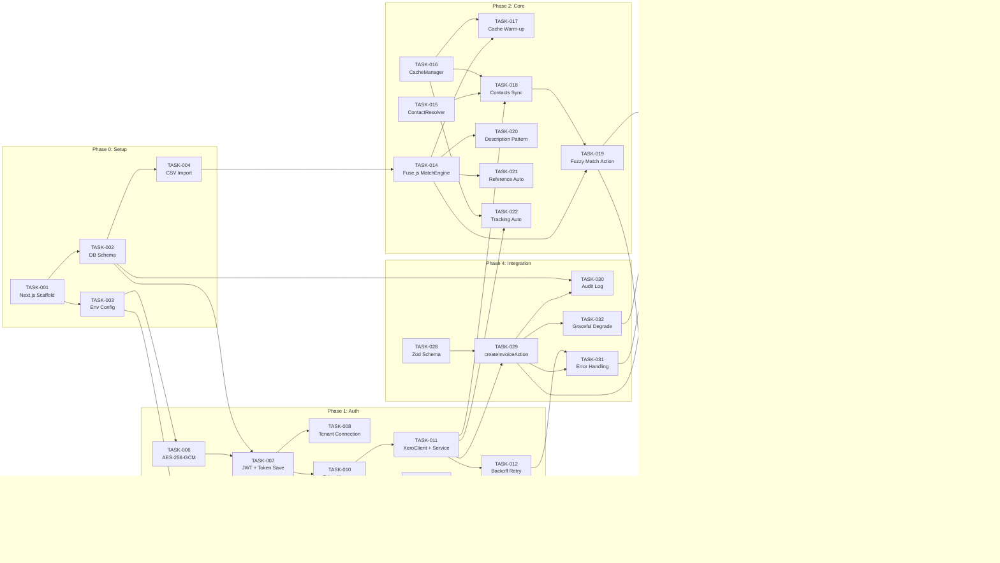
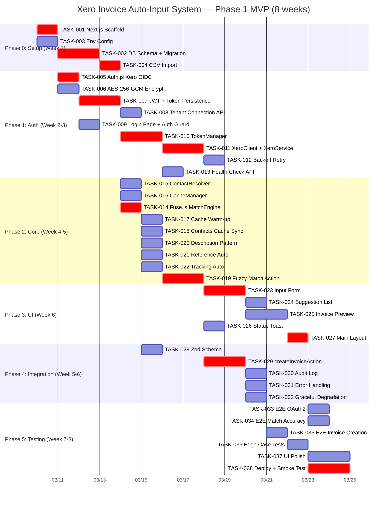

# Tasks: xero-invoice-auto-input

> Xero API連携インボイス自動入力システム — Phase 1 MVP タスク分解（8週間）

---

## Phase 0: Setup（プロジェクト基盤構築）

### TASK-001: Next.js プロジェクトスキャフォールド
- Phase: 0
- Implements: REQ-904
- Depends: なし
- Effort: 0.5 day(s)
- Description: Next.js 15.2.3+ プロジェクトを TypeScript strict モード、App Router、Tailwind CSS、shadcn/ui で作成する。next.config.ts に serverExternalPackages（xero-node, better-sqlite3）を設定する。
- Acceptance: `npm run dev` でローカルサーバーが起動し、Tailwind スタイルが適用されたトップページが表示される。tsconfig.json の strict が true である。

### TASK-002: DB スキーマ定義と migration
- Phase: 0
- Implements: REQ-014, REQ-004, REQ-005
- Depends: TASK-001
- Effort: 1.5 day(s)
- Description: Drizzle ORM + better-sqlite3 を導入し、schema.ts に全6テーブル（xero_tokens, invoice_history, contacts_cache, accounts_cache, tracking_categories_cache, created_invoices）を定義する。Drizzle migration を実行し SQLite ファイルが生成されることを確認する。
- Acceptance: `npx drizzle-kit push` が成功し、SQLite ファイルに6テーブルが存在する。各テーブルのカラム定義が requirements.md の仕様と一致する。

### TASK-003: 環境変数テンプレートと .gitignore 設定
- Phase: 0
- Implements: REQ-904
- Depends: TASK-001
- Effort: 0.5 day(s)
- Description: .env.example（値なし）と .env.local テンプレートを作成する。必須環境変数: XERO_CLIENT_ID, XERO_CLIENT_SECRET, ENCRYPTION_KEY, NEXTAUTH_SECRET, NEXTAUTH_URL。.gitignore に .env*, *.sqlite を追加する。起動時に必須環境変数の存在チェックを行い、未設定の場合はエラーで起動を中止する。
- Acceptance: .env.example に全必須変数が列挙されている。.gitignore に .env* が含まれる。環境変数未設定で `npm run dev` するとエラーメッセージが表示される。

### TASK-004: CSV データインポートスクリプト
- Phase: 0
- Implements: REQ-004, REQ-005, REQ-006, REQ-007, REQ-009
- Depends: TASK-002
- Effort: 1 day(s)
- Description: 過去3年分の Xero エクスポート CSV（38ファイル、18,860行）を invoice_history テーブルにインポートするスクリプトを作成する。重複チェック（InvoiceNumber ユニーク制約）、文字コード処理、カラムマッピングを実装する。
- Acceptance: スクリプト実行後、invoice_history テーブルに 18,860 行が格納される。重複実行しても行数が増えない。

---

## Phase 1: Auth（OAuth2 認証）

### TASK-005: Auth.js v5 Xero OIDC プロバイダー設定
- Phase: 1
- Implements: REQ-001
- Depends: TASK-003
- Effort: 1 day(s)
- Description: Auth.js v5（next-auth@5）をインストールし、auth.ts にカスタム Xero OIDC プロバイダーを定義する。issuer: identity.xero.com、scopes: openid profile email offline_access accounting.transactions accounting.contacts accounting.settings。
- Acceptance: Auth.js の設定ファイルが存在し、Xero プロバイダーが正しいスコープで定義されている。

### TASK-006: AES-256-GCM トークン暗号化モジュール
- Phase: 1
- Implements: REQ-902
- Depends: TASK-003
- Effort: 0.5 day(s)
- Description: lib/xero/encrypt.ts に node:crypto を使用した AES-256-GCM 暗号化/復号化関数を実装する。暗号化キーは ENCRYPTION_KEY 環境変数から取得する。
- Acceptance: 平文トークンを暗号化→復号化し、元の値と一致する。SQLite に保存されるトークンが Base64 エンコードされた暗号文であり、平文 JWT が含まれない。

### TASK-007: JWT コールバックとトークン永続化
- Phase: 1
- Implements: REQ-001, REQ-902
- Depends: TASK-005, TASK-006, TASK-002
- Effort: 1.5 day(s)
- Description: Auth.js JWT callback で access_token, refresh_token, expires_at をトークンに保存する。認証成功後、AES-256-GCM で暗号化して SQLite xero_tokens テーブルに保存する。
- Acceptance: Xero 認証成功後、xero_tokens テーブルにレコードが1件保存される。access_token カラムが暗号文である。

### TASK-008: Xero テナント接続 API ルート
- Phase: 1
- Implements: REQ-001
- Depends: TASK-007
- Effort: 1 day(s)
- Description: GET /api/xero/connections ルートを実装する。認証後に Xero /connections エンドポイントを呼び出し、tenantId を取得して xero_tokens テーブルに保存する。
- Acceptance: 認証フロー完了後、tenantId が xero_tokens テーブルに保存されている。

### TASK-009: ログインページと認証ガード
- Phase: 1
- Implements: REQ-001
- Depends: TASK-005
- Effort: 1 day(s)
- Description: /login ページに「Connect to Xero」ボタンを配置し、Auth.js signIn をトリガーする。middleware.ts で未認証リクエストを /login にリダイレクトする認証ガードを実装する。
- Acceptance: 未認証状態でダッシュボードにアクセスすると /login にリダイレクトされる。「Connect to Xero」ボタン押下で Xero ログイン画面に遷移する。

### TASK-010: TokenManager（自動更新 + Mutex ロック）
- Phase: 1
- Implements: REQ-002
- Depends: TASK-007
- Effort: 1.5 day(s)
- Description: lib/xero/token-manager.ts に TokenManager クラスを実装する。アクセストークン有効期限5分前にプロアクティブリフレッシュを行う。async-mutex パッケージで同時リフレッシュの競合を防止する。リフレッシュトークン失効時は /login にリダイレクトする。
- Acceptance: トークン有効期限残り4分でリフレッシュが実行される。同時に2つのリフレッシュリクエストが発生しても1つのみ実行される。

### TASK-011: XeroClient シングルトンと XeroService
- Phase: 1
- Implements: REQ-013, REQ-903
- Depends: TASK-010
- Effort: 2 day(s)
- Description: lib/xero/client.ts に xero-node XeroClient シングルトンを実装する。lib/xero/xero-service.ts に createInvoice(), getContacts(), getAccountCodes(), getTrackingCategories() を実装し、p-queue で 50 リクエスト/分のレート制限を行う。
- Acceptance: XeroService の各メソッドが呼び出し可能。p-queue によるレート制限が機能する。

### TASK-012: 指数バックオフリトライ機構
- Phase: 1
- Implements: REQ-013 (EH-018), REQ-903
- Depends: TASK-011
- Effort: 0.5 day(s)
- Description: HTTP 429 レスポンスをキャッチし、1秒→2秒→4秒→8秒→16秒の指数バックオフで最大5回リトライするラッパーを実装する。全リトライ失敗時はエラーメッセージを返す。
- Acceptance: HTTP 429 返却時に指数バックオフでリトライされる。5回失敗後に適切なエラーメッセージが返る。

### TASK-013: Xero ヘルスチェック API
- Phase: 1
- Implements: REQ-002
- Depends: TASK-010
- Effort: 0.5 day(s)
- Description: GET /api/xero/health ルートを実装する。トークンの有効性確認とレート制限ステータスを返す。
- Acceptance: 正常時に {status: "healthy", tokenValid: true, rateLimit: {...}} が返る。

---

## Phase 2: Core（マッチエンジン・キャッシュ・自動補完）

### TASK-014: Fuse.js マッチエンジン
- Phase: 2
- Implements: REQ-004, REQ-005, REQ-006, REQ-007, REQ-009, REQ-901
- Depends: TASK-004
- Effort: 1 day(s)
- Description: lib/match/engine.ts に Fuse.js を使用したマッチエンジンを実装する。invoice_history テーブルからデータを読み込み、Fuse.js インデックスを構築する。重み: project=2.0, unitNo=1.5, description=1.0。
- Acceptance: 18,860 件の履歴データでインデックスが構築される。検索結果がスコア順に返る。

### TASK-015: ContactResolver（ContactName パーサー）
- Phase: 2
- Implements: REQ-004
- Depends: なし
- Effort: 1 day(s)
- Description: lib/match/contact-resolver.ts に ContactName のパース処理を実装する。Xero ContactName 形式「{Project} {Unit} (O){Owner}」を構造化フィールドに分解する。
- Acceptance: 「Suasana Iskandar 17-07 Nur Nadzira Binti MD Sap」が project=Suasana, unit=17-07, owner=Nur Nadzira... に分解される。

### TASK-016: インメモリキャッシュマネージャー
- Phase: 2
- Implements: REQ-004, REQ-005, REQ-007, REQ-008, REQ-901
- Depends: なし
- Effort: 1 day(s)
- Description: lib/cache/memory-cache.ts に CacheManager を実装する。インメモリ Map で contacts（TTL: 60分）、accountCodes（TTL: 24時間）、trackingCategories（TTL: 24時間）を管理する。
- Acceptance: キャッシュに値を設定し、TTL 内に取得できる。TTL 経過後は null が返る。

### TASK-017: キャッシュウォームアップ
- Phase: 2
- Implements: REQ-004, REQ-005, REQ-901
- Depends: TASK-014, TASK-016
- Effort: 0.5 day(s)
- Description: lib/cache/warm-up.ts にキャッシュウォームアップ処理を実装する。contacts_cache テーブルからインメモリ Map にロードし、Fuse.js インデックスを再構築する。instrumentation.ts から呼び出す。
- Acceptance: サーバー起動時にキャッシュがウォームアップされ、初回リクエストから高速応答が可能。

### TASK-018: Contacts キャッシュ同期アクション
- Phase: 2
- Implements: REQ-015, REQ-004
- Depends: TASK-015, TASK-016, TASK-011
- Effort: 1 day(s)
- Description: app/actions/sync.ts に syncContactsCacheAction を実装する。Xero Contacts API からコンタクトを取得し、ContactResolver でパースし、contacts_cache テーブルとインメモリ Map に upsert する。
- Acceptance: 「データ同期」実行後、Xero 側の新規コンタクトがローカルキャッシュに反映される。

### TASK-019: ファジーマッチアクション
- Phase: 2
- Implements: REQ-004, REQ-005, REQ-006, REQ-007, REQ-008, REQ-009, REQ-010, REQ-012
- Depends: TASK-014, TASK-018
- Effort: 1.5 day(s)
- Description: app/actions/match.ts に fuzzyMatchAction を実装する。{project, unitNo, detail, date} を受け取り、Fuse.js 検索を実行。上位5件の MatchSuggestion（contactName, accountCode, trackingOption1, trackingOption2, description, reference, dueDate 等）を返す。ContactName → Address の自動取得、Date → DueDate の自動計算を含む。
- Acceptance: Project=Suasana, UnitNo=17-07 で検索すると、ContactName 候補が5件以内で返る。応答時間が 500ms 以内。

### TASK-020: Description パターンマッチング
- Phase: 2
- Implements: REQ-006
- Depends: TASK-014
- Effort: 1 day(s)
- Description: Detail 入力値に対して、過去履歴の Description パターン（WATER CHARGES {MONTH} {YEAR}、ELECTRIC CHARGES {MONTH} {YEAR}、RENTAL FOR {MONTH} {YEAR} 等）をマッチングし、日付情報と組み合わせて Description 候補を生成する。定型パターンに該当しない場合は Detail をそのまま Description に設定する。
- Acceptance: Detail=「WATER」+ Date=「03/02/2026」で「WATER CHARGES FEB 2026」が候補に含まれる。Detail=「COOKER HOOD REPAIR」ではそのまま返る。

### TASK-021: Reference 自動判定ロジック
- Phase: 2
- Implements: REQ-009
- Depends: TASK-014
- Effort: 0.5 day(s)
- Description: Detail 入力値から INVOICE / DEBIT NOTE を自動判定するロジックを実装する。REPAIR 系は INVOICE、RENTAL/WATER CHARGES/ELECTRIC CHARGES 等は DEBIT NOTE。判定不能時は INVOICE をデフォルト設定。
- Acceptance: REPAIR を含む Detail で INVOICE、RENTAL を含む Detail で DEBIT NOTE が設定される。

### TASK-022: TrackingOption1/2 自動選択ロジック
- Phase: 2
- Implements: REQ-007, REQ-008
- Depends: TASK-016, TASK-011
- Effort: 1 day(s)
- Description: Detail 入力から TrackingOption1（NATURE OF ACCOUNT、28種類）を自動選択するロジックを実装する。Project 入力から TrackingOption2（Categories/Projects、25種類）を自動選択するロジックを実装する。Xero TrackingCategories API キャッシュを参照する。新規値は自動生成しない。
- Acceptance: Detail=「COOKER HOOD REPAIR」で TrackingOption1=「IN - REP」。Project=「MP4」で TrackingOption2=「MP4」。

---

## Phase 3: UI（入力フォーム・プレビュー・送信）

### TASK-023: 5項目入力フォームコンポーネント
- Phase: 3
- Implements: REQ-003
- Depends: TASK-019
- Effort: 1.5 day(s)
- Description: app/components/InvoiceForm.tsx に5項目入力フォームを構築する。Date（日付ピッカー）、Project（ドロップダウン、25プロジェクト）、Unit No（テキスト入力）、Detail（テキスト入力）、Final Price（数値入力、小数点以下2桁）。React Hook Form + Zod でバリデーション。onChange で 300ms デバウンス後に fuzzyMatchAction を呼び出す。
- Acceptance: 5フィールドが表示される。必須未入力でエラー表示。Final Price に0以下でバリデーションエラー。入力後300msで自動補完が動作する。

### TASK-024: サジェストリストコンポーネント
- Phase: 3
- Implements: REQ-004, REQ-005
- Depends: TASK-023
- Effort: 1 day(s)
- Description: app/components/SuggestionList.tsx にマッチ候補リスト（最大5件）を構築する。各候補に project/unit/contactName のプレビューを表示する。クリックで全フィールドを自動入力する。
- Acceptance: fuzzyMatchAction の結果が最大5件表示される。候補クリックで全フィールドが自動入力される。

### TASK-025: インボイスプレビューコンポーネント
- Phase: 3
- Implements: REQ-011, REQ-016
- Depends: TASK-023
- Effort: 1.5 day(s)
- Description: app/components/InvoicePreview.tsx に全16フィールド（ContactName, EmailAddress, SAAddressLine1, InvoiceDate, DueDate, Reference, Description, Quantity, UnitAmount, LineAmount, AccountCode, TaxType, TrackingOption1, TrackingOption2, Currency, Type）を表示する。全フィールド編集可能。自動補完が不完全なフィールドは赤ボーダーでハイライト。固定値（TaxType=Tax Exempt, Currency=MYR, Quantity=1.0000, Type=Sales invoice）をプリセット。
- Acceptance: 15フィールドが全て表示される。各フィールドをクリックして編集できる。不完全フィールドが赤ボーダーでハイライトされる。

### TASK-026: ステータストーストコンポーネント
- Phase: 3
- Implements: REQ-013
- Depends: なし
- Effort: 0.5 day(s)
- Description: app/components/StatusToast.tsx に成功（InvoiceID + Xero 管理画面リンク）、エラー（アクションメッセージ）、ローディングスピナーのトーストを実装する。
- Acceptance: 成功時に「インボイス JJB26-XXXX を作成しました」とリンクが表示される。エラー時にエラーメッセージが表示される。

### TASK-027: メインページレイアウト
- Phase: 3
- Implements: REQ-003, REQ-011
- Depends: TASK-023, TASK-024, TASK-025, TASK-026
- Effort: 1 day(s)
- Description: ダッシュボードページにログイン状態検出、InvoiceForm + InvoicePreview のサイドバイサイドレイアウト、「Xeroへ送信」ボタン、「データ同期」ボタンを配置する。
- Acceptance: 認証済みでダッシュボードが表示される。左に入力フォーム、右にプレビュー。送信ボタンと同期ボタンが機能する。

---

## Phase 4: Integration（Xero インボイス作成・エラー処理・監査ログ）

### TASK-028: Zod バリデーションスキーマ
- Phase: 4
- Implements: REQ-003, REQ-016
- Depends: なし
- Effort: 0.5 day(s)
- Description: InvoiceFormData の Zod スキーマを定義する。全16フィールドのバリデーション（MYR 通貨、Tax Exempt、日付形式 D/MM/YYYY、Final Price > 0）。
- Acceptance: 有効なデータでバリデーション成功。不正データで適切なエラーメッセージが返る。

### TASK-029: createInvoiceAction 実装
- Phase: 4
- Implements: REQ-013, REQ-016
- Depends: TASK-011, TASK-028
- Effort: 2 day(s)
- Description: app/actions/invoice.ts に createInvoiceAction を実装する。InvoiceFormData を Zod でバリデーション後、Xero Invoice API ペイロードにマッピング（ACCREC type, LineItems, Tracking with Name+Option strings, LineAmountTypes=Exclusive, Status=DRAFT）し、XeroService.createInvoice() を呼び出す。
- Acceptance: 全フィールド入力済みのデータで Xero に DRAFT インボイスが作成される。InvoiceID と InvoiceNumber が返る。

### TASK-030: インボイス作成ログ保存
- Phase: 4
- Implements: REQ-014
- Depends: TASK-029, TASK-002
- Effort: 0.5 day(s)
- Description: Xero インボイス作成成功時に InvoiceID, InvoiceNumber, ContactName, Total, 作成日時, 作成者を created_invoices テーブルに保存する。SQLite 書き込み失敗時はコンソールログに出力し、Xero 側の結果は成功として扱う。
- Acceptance: インボイス作成後、created_invoices テーブルにレコードが保存される。

### TASK-031: Xero API エラーハンドリング
- Phase: 4
- Implements: REQ-013 (EH-017, EH-018, EH-019), REQ-001 (EH-001, EH-002)
- Depends: TASK-029, TASK-012
- Effort: 1 day(s)
- Description: HTTP 400（バリデーションエラー）→ Xero エラーメッセージ表示 + フィールドハイライト。HTTP 429（レート制限）→ 指数バックオフリトライ。HTTP 401（認証エラー）→ トークン自動更新試行 → 失敗時 /login リダイレクト。Xero 未到達時 → PENDING_XERO ステータスでローカル保存。
- Acceptance: 各 HTTP エラーコードに対して適切なハンドリングが実行される。

### TASK-032: グレースフルデグラデーション
- Phase: 4
- Implements: REQ-004 (EH-008), REQ-015 (EH-021)
- Depends: TASK-029
- Effort: 1 day(s)
- Description: Xero API 到達不能時に PENDING_XERO ステータスでローカル保存し、5分間隔でバックグラウンドリトライする。キャッシュ同期失敗時は既存キャッシュを保持し通知を表示する。
- Acceptance: Xero API ブロック時にインボイスが PENDING_XERO で保存される。API 回復時に自動リトライされる。

---

## Phase 5: Testing & Polish（E2E テスト・エッジケース・監視）

### TASK-033: E2E テスト — OAuth2 フロー
- Phase: 5
- Implements: REQ-001, REQ-002
- Depends: TASK-009, TASK-010
- Effort: 1 day(s)
- Description: Xero サンドボックスアカウントで完全な OAuth2 フロー（認証 → connections → トークン保存 → トークンリフレッシュ）の E2E テストを実施する。
- Acceptance: 認証フロー完了後、xero_tokens にトークンが保存される。トークン期限切れ後に自動リフレッシュされる。

### TASK-034: E2E テスト — ファジーマッチ精度
- Phase: 5
- Implements: REQ-004, REQ-005, REQ-006, REQ-007, REQ-901
- Depends: TASK-019
- Effort: 1 day(s)
- Description: 実際の過去データから20パターンを選定し、ファジーマッチの精度テストを実施する。ContactName 正答率 90%以上、AccountCode 正答率 85%以上を検証する。応答時間 500ms 以内を Performance API で計測する。
- Acceptance: 20パターンで ContactName 90%以上、AccountCode 85%以上の正答率。応答時間 500ms 以内。

### TASK-035: E2E テスト — インボイス作成
- Phase: 5
- Implements: REQ-013, REQ-014
- Depends: TASK-029
- Effort: 1 day(s)
- Description: Xero サンドボックスでインボイス作成の E2E テスト。5項目入力 → 自動補完 → プレビュー確認 → Xero 送信 → InvoiceID 取得 → Xero ダッシュボードで確認 → created_invoices テーブルのログ確認。
- Acceptance: Xero にDRAFT インボイスが作成され、ダッシュボードに表示される。created_invoices にログが保存される。

### TASK-036: エッジケーステスト
- Phase: 5
- Implements: REQ-002 (EH-003, EH-004), REQ-903
- Depends: TASK-031, TASK-032
- Effort: 1 day(s)
- Description: レート制限（HTTP 429 指数バックオフ）、トークンリフレッシュ（DB 上で手動期限切れ）、グレースフルデグラデーション（Xero API ブロック）、日次上限 4,500 件到達のエッジケーステスト。
- Acceptance: 全エッジケースで適切なエラーハンドリングが動作する。

### TASK-037: UI ポリッシュ
- Phase: 5
- Implements: REQ-011, REQ-901
- Depends: TASK-027
- Effort: 1.5 day(s)
- Description: エラーバウンダリコンポーネント、自動補完/プレビューのローディングスケルトン、Tailwind ブレークポイント（sm, md）でのレスポンシブレイアウトを追加する。クロスブラウザテスト（Chrome, Safari, Edge）。
- Acceptance: レンダリングエラーでクラッシュしない。ローディング中にスケルトンが表示される。Chrome/Safari/Edge で正常動作。

### TASK-038: ローカルデプロイと最終スモークテスト
- Phase: 5
- Implements: REQ-013, REQ-001
- Depends: TASK-033, TASK-034, TASK-035, TASK-036, TASK-037
- Effort: 1.5 day(s)
- Description: PM2 または Docker Compose でローカルプロダクション環境をセットアップする。実際の Xero アカウントでスモークテスト。スタッフ3名でオンボーディング（3件のインボイス作成例を実演）。
- Acceptance: プロダクション環境でインボイス作成が正常動作する。スタッフが独力でインボイスを作成できる。

---

## Dependency Graph

---

## Gantt Chart

---

## REQ → TASK Traceability Matrix

| REQ ID | REQ Title | Tasks |
|--------|-----------|-------|
| REQ-001 | Xero OAuth2 認証 | TASK-005, TASK-007, TASK-008, TASK-009, TASK-031, TASK-033 |
| REQ-002 | トークン自動更新 | TASK-010, TASK-013, TASK-033, TASK-036 |
| REQ-003 | 5項目入力フォーム | TASK-023, TASK-025, TASK-027, TASK-028 |
| REQ-004 | ContactName 自動補完 | TASK-004, TASK-014, TASK-015, TASK-016, TASK-017, TASK-018, TASK-019, TASK-024, TASK-034 |
| REQ-005 | AccountCode 自動補完 | TASK-004, TASK-014, TASK-016, TASK-017, TASK-019, TASK-024, TASK-034 |
| REQ-006 | Description 自動補完 | TASK-004, TASK-014, TASK-019, TASK-020, TASK-034 |
| REQ-007 | TrackingOption1 自動補完 | TASK-004, TASK-014, TASK-016, TASK-019, TASK-022, TASK-034 |
| REQ-008 | TrackingOption2 自動補完 | TASK-016, TASK-019, TASK-022 |
| REQ-009 | Reference 自動判定 | TASK-004, TASK-014, TASK-019, TASK-021 |
| REQ-010 | Address 自動補完 | TASK-019 |
| REQ-011 | インボイスプレビュー画面 | TASK-025, TASK-027, TASK-037 |
| REQ-012 | DueDate 自動計算 | TASK-019 |
| REQ-013 | Xero DRAFT インボイス作成 | TASK-011, TASK-012, TASK-026, TASK-029, TASK-030, TASK-031, TASK-035 |
| REQ-014 | インボイス作成ログ保存 | TASK-002, TASK-030, TASK-035 |
| REQ-015 | キャッシュ同期 | TASK-018, TASK-032 |
| REQ-016 | 固定値自動設定 | TASK-025, TASK-028, TASK-029 |
| REQ-901 | 応答時間（500ms 以内） | TASK-014, TASK-016, TASK-017, TASK-019, TASK-034 |
| REQ-902 | データ暗号化（AES-256-GCM） | TASK-006, TASK-007 |
| REQ-903 | API レート制限対応 | TASK-011, TASK-012, TASK-036 |
| REQ-904 | 認証情報保護 | TASK-001, TASK-003 |

---

## Summary

- **Total Tasks:** 38
- **Total Effort:** ~38 person-days (8 weeks)
- **Critical Path:** TASK-001 → TASK-002 → TASK-004 → TASK-014 → TASK-019 → TASK-023 → TASK-027 → TASK-038
- **Phase 1 MVP Deadline:** 2026-05-01 (8 weeks from 2026-03-10)
