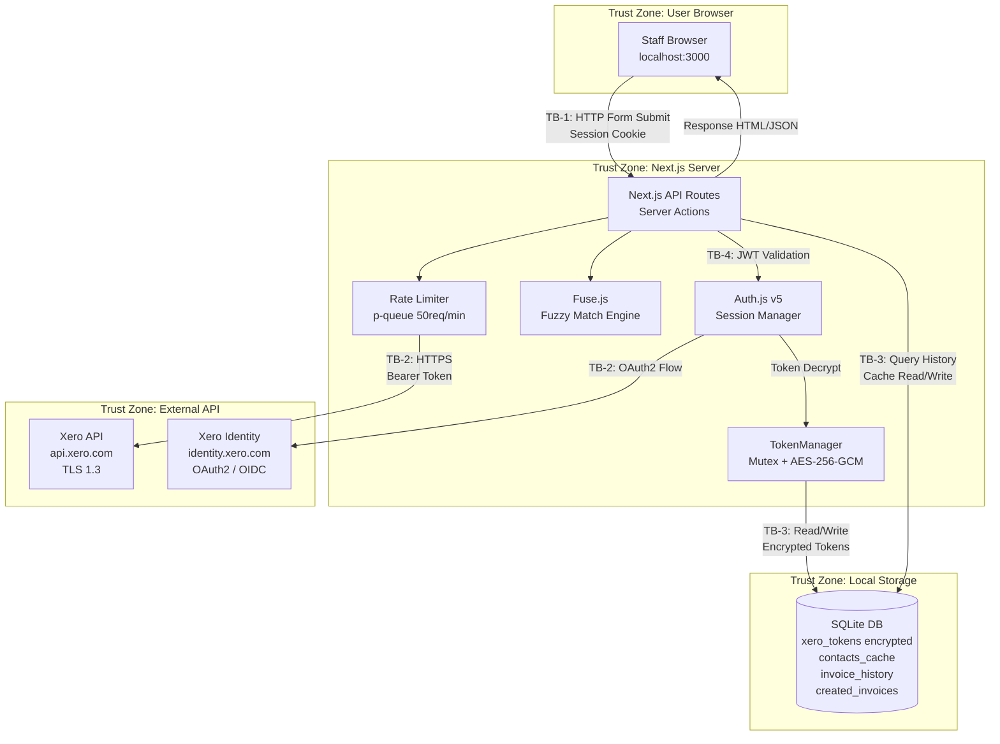

# Threat Model: Xero Invoice Auto-Input System

**Date:** 2026-03-10
**Methodology:** STRIDE
**Security Context:** localhost only, single tenant, no public internet exposure, Malaysian PDPA compliance

---

## 1. Trust Boundaries

| ID | Boundary | From | To | Protocol |
|----|----------|------|----|----------|
| TB-1 | Browser to Next.js Server | User browser (localhost:3000) | Next.js API Routes / Server Actions | HTTP (localhost, no TLS) |
| TB-2 | Next.js Server to Xero API | Next.js server process | Xero REST API (api.xero.com) | HTTPS / TLS 1.3 |
| TB-3 | Next.js Server to SQLite | Next.js server process | SQLite database file (local filesystem) | File I/O (better-sqlite3) |
| TB-4 | Auth.js Session Boundary | Browser cookie | Next.js Auth.js middleware | Encrypted JWT cookie |
| TB-5 | Environment to Process | .env.local file | Node.js process.env | OS file read |

---

## 2. Data Flow Diagram

---

## 3. STRIDE Analysis by Trust Boundary

### TB-1: Browser to Next.js Server

#### S - Spoofing

| ID | Threat | Impact | Probability | Risk Score | Mitigation |
|----|--------|--------|-------------|------------|------------|
| S-01 | Session hijacking via cookie theft | High | Low | LOW (H x L) | localhost-only operation eliminates network sniffing. Auth.js cookies use HttpOnly + SameSite=Strict. No external network exposure (CON-006). |
| S-02 | CSRF attack submitting unauthorized invoices | High | Low | LOW (H x L) | Next.js Server Actions include built-in CSRF protection. SameSite=Strict cookies. localhost-only access. |
| S-03 | Unauthorized user accesses the system on shared office PC | Medium | Medium | MEDIUM (M x M) | Auth.js session timeout (8-10 hours). Xero OAuth re-authorization required. **REQ-SEC-001: Implement session idle timeout of 30 minutes.** |

#### T - Tampering

| ID | Threat | Impact | Probability | Risk Score | Mitigation |
|----|--------|--------|-------------|------------|------------|
| T-01 | Invoice data manipulation in transit (browser to server) | High | Low | LOW (H x L) | localhost traffic not routable externally. Server-side validation of all fields before Xero API call. |
| T-02 | Malicious modification of auto-completed fields before submission | Medium | Medium | MEDIUM (M x M) | All fields editable by design (REQ-011). Invoice created as DRAFT (REQ-013). Audit log captures submitted values (REQ-014). Human-in-the-loop preview gate. |

#### R - Repudiation

| ID | Threat | Impact | Probability | Risk Score | Mitigation |
|----|--------|--------|-------------|------------|------------|
| R-01 | Staff denies creating an invoice | High | Medium | HIGH (H x M) | REQ-014 audit log records creator identity, timestamp, all field values. **REQ-SEC-002: Audit log must include Auth.js session user ID (email from Xero OIDC) for each operation.** |
| R-02 | Unauthorized invoice creation without trace | High | Low | MEDIUM (H x L) | Auth.js session required for all API routes. created_invoices table logs every submission. Xero DRAFT status provides secondary audit trail. |

#### I - Information Disclosure

| ID | Threat | Impact | Probability | Risk Score | Mitigation |
|----|--------|--------|-------------|------------|------------|
| I-01 | Contact personal data (names, emails, addresses) exposed in browser console/network tab | Medium | Medium | MEDIUM (M x M) | Data is functionally required in the UI. localhost-only limits exposure. **REQ-SEC-003: Disable verbose error messages in production mode; sanitize API responses to exclude unnecessary PII fields.** |
| I-02 | OAuth tokens leaked to client-side JavaScript | Critical | Low | MEDIUM (C x L) | REQ-904 ensures tokens are server-side only. xero-node SDK restricted to Server Actions/API Routes (CON-003). Auth.js stores tokens in encrypted JWT, not accessible to client JS. |

#### D - Denial of Service

| ID | Threat | Impact | Probability | Risk Score | Mitigation |
|----|--------|--------|-------------|------------|------------|
| D-01 | Repeated form submissions overwhelming the server | Low | Low | LOW (L x L) | localhost single-tenant; max 10 concurrent users (ASM-005). Rate limiter on Xero API calls (REQ-903). |

#### E - Elevation of Privilege

| ID | Threat | Impact | Probability | Risk Score | Mitigation |
|----|--------|--------|-------------|------------|------------|
| E-01 | Staff bypasses preview to directly call Xero API route | High | Low | MEDIUM (H x L) | Auth.js session validation on all API routes. Server-side validation rejects malformed payloads. **REQ-SEC-004: All Xero-facing API routes must validate Auth.js session before processing.** |

---

### TB-2: Next.js Server to Xero API

#### S - Spoofing

| ID | Threat | Impact | Probability | Risk Score | Mitigation |
|----|--------|--------|-------------|------------|------------|
| S-04 | Man-in-the-middle attack on Xero API calls | Critical | Low | MEDIUM (C x L) | TLS 1.3 enforced by Xero API. Certificate validation by Node.js default. xero-node SDK uses HTTPS exclusively. |
| S-05 | Stolen OAuth access token used from another machine | High | Low | LOW (H x L) | Access token lifetime is 30 minutes (CON-002). Token encrypted at rest (REQ-902). localhost-only means token never traverses external network. |

#### T - Tampering

| ID | Threat | Impact | Probability | Risk Score | Mitigation |
|----|--------|--------|-------------|------------|------------|
| T-03 | API response tampered to inject malicious data | High | Low | LOW (H x L) | TLS 1.3 protects response integrity. Server validates Xero response schema before processing. |

#### R - Repudiation

| ID | Threat | Impact | Probability | Risk Score | Mitigation |
|----|--------|--------|-------------|------------|------------|
| R-03 | Invoice created in Xero but local audit log fails to record | Medium | Low | LOW (M x L) | REQ-014 EH-020: SQLite write failure does not block Xero operation. Xero maintains its own audit trail. **REQ-SEC-005: On audit log write failure, retry once and log to stderr as fallback.** |

#### I - Information Disclosure

| ID | Threat | Impact | Probability | Risk Score | Mitigation |
|----|--------|--------|-------------|------------|------------|
| I-03 | Xero API error responses leak tenant data in logs | Medium | Medium | MEDIUM (M x M) | REQ-904 prohibits credentials in logs. **REQ-SEC-006: Implement structured logging with field allowlist; redact token values and full error payloads before logging.** |

#### D - Denial of Service

| ID | Threat | Impact | Probability | Risk Score | Mitigation |
|----|--------|--------|-------------|------------|------------|
| D-02 | Xero API rate limit exhaustion (60/min, 5000/day) | High | Medium | HIGH (H x M) | REQ-903 caps at 50 req/min, daily limit at 4,500. Exponential backoff on HTTP 429 (REQ-013 EH-018). Cache TTLs reduce redundant calls (Contacts: 1h, Accounts/Tracking: 24h). |
| D-03 | Xero API outage prevents invoice creation | High | Low | MEDIUM (H x L) | System shows error message (REQ-013 EH-017). Invoices can be retried. No data loss as preview data persists in browser. |

#### E - Elevation of Privilege

| ID | Threat | Impact | Probability | Risk Score | Mitigation |
|----|--------|--------|-------------|------------|------------|
| E-02 | OAuth scopes grant more access than needed | Medium | Medium | MEDIUM (M x M) | Scope minimization documented in compliance_notes.md. System only uses accounting.transactions (write DRAFT), accounting.contacts (read), accounting.settings (read). **REQ-SEC-007: Migrate to granular scopes (accounting.invoices) when available (target May 2026, deadline Sep 2027).** |

---

### TB-3: Next.js Server to SQLite

#### S - Spoofing

| ID | Threat | Impact | Probability | Risk Score | Mitigation |
|----|--------|--------|-------------|------------|------------|
| S-06 | Attacker replaces SQLite file with malicious copy | Critical | Low | MEDIUM (C x L) | OS-level file permissions (chmod 600). localhost-only access. **REQ-SEC-008: Set SQLite file permissions to owner read/write only (600).** |

#### T - Tampering

| ID | Threat | Impact | Probability | Risk Score | Mitigation |
|----|--------|--------|-------------|------------|------------|
| T-04 | Direct modification of SQLite database (token table, invoice history) | Critical | Low | MEDIUM (C x L) | Tokens encrypted with AES-256-GCM (REQ-902); tampering detected by auth tag verification. OS file permissions. Daily backup (R-07 mitigation). |
| T-05 | SQL injection via user input | High | Low | LOW (H x L) | Drizzle ORM uses parameterized queries exclusively (ADR-003). No raw SQL in application code. |

#### R - Repudiation

| ID | Threat | Impact | Probability | Risk Score | Mitigation |
|----|--------|--------|-------------|------------|------------|
| R-04 | Audit log records deleted from SQLite | High | Low | MEDIUM (H x L) | OS file permissions. **REQ-SEC-009: created_invoices table should be append-only at application level (no DELETE/UPDATE operations exposed).** |

#### I - Information Disclosure

| ID | Threat | Impact | Probability | Risk Score | Mitigation |
|----|--------|--------|-------------|------------|------------|
| I-04 | SQLite file copied, exposing contact PII and encrypted tokens | High | Low | MEDIUM (H x L) | Tokens are AES-256-GCM encrypted (REQ-902). Contact data is operational cache only. OS file permissions. PDPA compliance: 7-year retention for financial records, purge contacts_cache on sync. |
| I-05 | ENCRYPTION_KEY leaked from .env.local | Critical | Low | MEDIUM (C x L) | REQ-904: .env.local in .gitignore. Key generated via openssl rand -hex 32. Key rotation procedure documented. **REQ-SEC-010: Validate ENCRYPTION_KEY entropy at startup (reject keys shorter than 32 bytes).** |

#### D - Denial of Service

| ID | Threat | Impact | Probability | Risk Score | Mitigation |
|----|--------|--------|-------------|------------|------------|
| D-04 | SQLite database corruption | High | Low | MEDIUM (H x L) | WAL mode enabled (R-07). Daily backups. Recovery from CSV re-import possible. |

#### E - Elevation of Privilege

| ID | Threat | Impact | Probability | Risk Score | Mitigation |
|----|--------|--------|-------------|------------|------------|
| E-03 | Application process runs with excessive OS permissions | Medium | Low | LOW (M x L) | Standard Node.js process. No root/admin required. **REQ-SEC-011: Document that the Node.js process should run under a dedicated non-admin user account.** |

---

## 4. Risk Scoring Summary

### Risk Scoring Matrix

|  | Low Impact | Medium Impact | High Impact | Critical Impact |
|--|-----------|--------------|-------------|----------------|
| **High Probability** | MEDIUM | HIGH | CRITICAL | CRITICAL |
| **Medium Probability** | LOW | MEDIUM | HIGH | HIGH |
| **Low Probability** | LOW | LOW | MEDIUM | MEDIUM |

### All Threats Sorted by Risk Score

| Risk | ID | Threat | Score |
|------|----|--------|-------|
| HIGH | D-02 | Xero API rate limit exhaustion | H x M |
| HIGH | R-01 | Staff denies creating an invoice (repudiation) | H x M |
| MEDIUM | S-03 | Unauthorized access on shared PC | M x M |
| MEDIUM | T-02 | Invoice field manipulation before submission | M x M |
| MEDIUM | R-02 | Unauthorized invoice creation without trace | H x L |
| MEDIUM | I-01 | Contact PII in browser dev tools | M x M |
| MEDIUM | I-02 | OAuth tokens leaked to client JS | C x L |
| MEDIUM | I-03 | Tenant data in error logs | M x M |
| MEDIUM | S-04 | MITM on Xero API calls | C x L |
| MEDIUM | E-01 | Bypass preview to call Xero API directly | H x L |
| MEDIUM | E-02 | Overly broad OAuth scopes | M x M |
| MEDIUM | S-06 | SQLite file replacement | C x L |
| MEDIUM | T-04 | Direct SQLite modification | C x L |
| MEDIUM | R-04 | Audit log deletion | H x L |
| MEDIUM | I-04 | SQLite file copied (PII exposure) | H x L |
| MEDIUM | I-05 | ENCRYPTION_KEY leaked | C x L |
| MEDIUM | D-03 | Xero API outage | H x L |
| MEDIUM | D-04 | SQLite corruption | H x L |
| LOW | S-01 | Session hijacking | H x L |
| LOW | S-02 | CSRF attack | H x L |
| LOW | S-05 | Stolen OAuth token | H x L |
| LOW | T-01 | Data tampering in transit | H x L |
| LOW | T-03 | API response tampering | H x L |
| LOW | T-05 | SQL injection | H x L |
| LOW | R-03 | Audit log write failure | M x L |
| LOW | D-01 | Form submission flood | L x L |
| LOW | E-03 | Excessive OS permissions | M x L |

---

## 5. Mitigation Mapping

### Existing Requirements Coverage

| Requirement | Threats Mitigated |
|-------------|-------------------|
| REQ-902 (Token AES-256-GCM encryption) | S-05, T-04, I-04, I-05 |
| REQ-904 (Credential protection) | I-02, I-03, I-05, E-03 |
| REQ-903 (Rate limit compliance) | D-02 |
| REQ-014 (Audit log) | R-01, R-02, R-03 |
| REQ-011 (Preview before submission) | T-02, E-01 |
| REQ-013 (DRAFT status) | T-02, R-02 |
| REQ-001 (OAuth2 with PKCE) | S-01, S-04 |
| REQ-002 (Token auto-refresh with mutex) | S-05, D-02 |

### New Security Recommendations

| ID | Recommendation | Threats Addressed | Priority | Effort |
|----|----------------|-------------------|----------|--------|
| REQ-SEC-001 | Session idle timeout of 30 minutes | S-03 | SHOULD | Low (Auth.js config) |
| REQ-SEC-002 | Audit log includes user identity (Xero OIDC email) | R-01, R-02 | MUST | Low (add field to created_invoices) |
| REQ-SEC-003 | Sanitize API responses; disable verbose errors in production | I-01, I-03 | SHOULD | Low (Next.js config) |
| REQ-SEC-004 | Auth.js session validation on all Xero-facing API routes | E-01 | MUST | Low (middleware) |
| REQ-SEC-005 | Audit log write retry + stderr fallback | R-03 | SHOULD | Low (try/catch) |
| REQ-SEC-006 | Structured logging with field allowlist; redact tokens | I-03, I-05 | MUST | Medium (logging setup) |
| REQ-SEC-007 | Migrate to granular OAuth scopes (May 2026) | E-02 | MUST | Low (scope string change) |
| REQ-SEC-008 | SQLite file permissions set to 600 | S-06, T-04, I-04, R-04 | MUST | Low (deployment script) |
| REQ-SEC-009 | Append-only audit log (no DELETE/UPDATE in app layer) | R-04 | MUST | Low (ORM constraint) |
| REQ-SEC-010 | Validate ENCRYPTION_KEY entropy at startup | I-05 | SHOULD | Low (startup check) |
| REQ-SEC-011 | Run Node.js process under dedicated non-admin user | E-03 | SHOULD | Low (deployment docs) |

---

## 6. PDPA-Specific Threat Considerations

| PDPA Principle | Threat | Mitigation |
|----------------|--------|------------|
| Purpose Limitation (S.6) | Contact data used beyond invoice creation | System only reads contacts for matching; no export/analytics features |
| Security (S.9) | PII exposure from SQLite theft | AES-256-GCM for tokens, OS file permissions, localhost-only |
| Retention (S.10) | Over-retention of contact cache | contacts_cache purged on sync; created_invoices retained 7 years per Income Tax Act 1967 |
| Access Rights (S.11-12) | No mechanism for data subject access requests | Handled operationally; SQLite can be queried manually by admin |

---

## Review Log

| Date | Reviewer | Notes |
|------|----------|-------|
| 2026-03-10 | Architect | Initial STRIDE analysis created |
