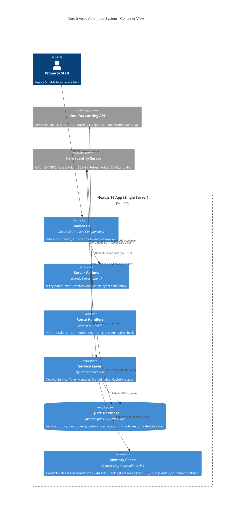

# Architecture Final - Xero Invoice Auto-Input System

**Date:** 2026-03-10
**Status:** Accepted
**Version:** 1.0

---

## Executive Summary

**Architecture Style:** Modular Monolith (Next.js 15 App Router, single deployable unit)
**Key Decision:** Single Next.js application with strict server/client boundary separation; xero-node SDK confined to server-side only.
**Target Scale:** ~500 invoices/month, 5-10 concurrent staff users, single Xero tenant.
**Estimated Timeline:** 8 weeks to MVP (Phase 1).

---

## 1. Component Diagram with Data Flows

### Input-to-Invoice Flow

```
Staff (browser)
  |
  | (1) Types 5 fields: Date, Project, Unit No, Detail, Final Price
  v
[Input Form] -- Server Action: fuzzyMatchAction -->
                  |
                  | (2) Search historical patterns
                  v
              [Match Engine (Fuse.js)]
                  |-- SQLite: invoice_history (18,860 rows)
                  |-- Memory cache: contacts, account_codes
                  |
                  | (3) Returns top-5 ranked suggestions
                  v
[Invoice Preview UI] (auto-filled: Contact, AccountCode, TaxType, Tracking1, Tracking2, Description, Reference)
  |
  | (4) Staff confirms or edits
  v
[Submit Button] -- Server Action: createInvoiceAction -->
                  |
                  | (5) Validate all fields
                  v
              [Xero API Service]
                  |
                  | (6) Get valid access token
                  v
              [Token Manager (mutex)]
                  |-- DB: xero_tokens (encrypted)
                  |-- Xero Identity: refresh if expiry < 5 min
                  |
                  | (7) POST /api.xro/2.0/Invoices
                  v
              [Xero API] (HTTP 200 + InvoiceID)
                  |
                  | (8) Record created invoice
                  v
              [SQLite: created_invoices] (local audit log)
                  |
                  | (9) Return success + Xero InvoiceID
                  v
[Success Toast + Link to Xero]
```

---

## 2. C4 Container Diagram (Mermaid)



---

## 3. API Endpoint Design

### Route Handlers (app/api/)

| Method | Path | Purpose | Auth Required |
|--------|------|---------|---------------|
| GET | `/api/auth/[...nextauth]` | Auth.js v5 catch-all: login, callback, session, signout | No |
| GET | `/api/xero/callback` | Xero OAuth2 redirect callback (handled by Auth.js) | No |
| GET | `/api/xero/connections` | Fetch Xero tenant list after auth, save tenantId | Session |
| GET | `/api/xero/health` | Token validity check + rate-limit status | Session |
| POST | `/api/xero/sync` | Manual trigger: re-sync contacts/accounts/tracking from Xero | Session |

### Server Actions (app/actions/)

| Action | File | Input | Output |
|--------|------|-------|--------|
| `fuzzyMatchAction` | `actions/match.ts` | `{ project, unitNo, detail }` | `MatchSuggestion[]` (top 5) |
| `createInvoiceAction` | `actions/invoice.ts` | `InvoiceFormData` (all fields) | `{ invoiceId, invoiceNumber, url }` |
| `syncContactsCacheAction` | `actions/sync.ts` | none | `{ synced: number }` |
| `getTrackingCategoriesAction` | `actions/sync.ts` | none | `TrackingCategory[]` |

### InvoiceFormData Schema (TypeScript)

```typescript
type InvoiceFormData = {
  // Staff inputs (5 fields)
  date: string;              // "D/MM/YYYY" format
  project: string;           // e.g. "Suasana Iskandar"
  unitNo: string;            // e.g. "17-07"
  detail: string;            // e.g. "WATER CHARGES MAR 2026"
  finalPrice: number;        // e.g. 150.00

  // Auto-filled (editable by staff before submit)
  contactId: string;         // Xero ContactID (UUID)
  contactName: string;       // Display name
  accountCode: string;       // e.g. "200"
  taxType: string;           // "Tax Exempt" (MYR, typical for JB property)
  trackingOption1: string;   // NATURE OF ACCOUNT value
  trackingOption2: string;   // Categories/Projects value (project name)
  description: string;       // Auto-generated description
  reference: string;         // "INVOICE" | "DEBIT NOTE" | etc.
  dueDate: string;           // Calculated or from contact payment terms
  invoiceType: string;       // "ACCREC" (Sales invoice, typical for this company)
  status: string;            // "DRAFT" | "AUTHORISED"
};
```

---

## 4. Database Schema (Drizzle ORM + SQLite)

```typescript
// schema.ts

// OAuth2 token storage (one row per authenticated user/tenant)
export const xeroTokens = sqliteTable('xero_tokens', {
  id: integer('id').primaryKey({ autoIncrement: true }),
  userId: text('user_id').notNull().unique(),
  tenantId: text('tenant_id').notNull(),
  tenantName: text('tenant_name').notNull().default(''),
  encryptedAccessToken: text('encrypted_access_token').notNull(),
  encryptedRefreshToken: text('encrypted_refresh_token').notNull(),
  expiresAt: integer('expires_at').notNull(),          // Unix timestamp (seconds)
  updatedAt: integer('updated_at').notNull().default(sql`(unixepoch())`),
});

// Xero contacts cache (synced from Xero, refreshed hourly)
export const contactsCache = sqliteTable('contacts_cache', {
  id: integer('id').primaryKey({ autoIncrement: true }),
  xeroContactId: text('xero_contact_id').notNull().unique(),
  name: text('name').notNull(),
  project: text('project').default(''),         // Extracted project name from contact name
  unitNo: text('unit_no').default(''),          // Extracted unit number
  ownerName: text('owner_name').default(''),    // Extracted owner name after "(O)"
  emailAddress: text('email_address').default(''),
  isActive: integer('is_active', { mode: 'boolean' }).notNull().default(true),
  syncedAt: integer('synced_at').notNull().default(sql`(unixepoch())`),
});

// Historical invoice patterns (bulk imported from CSV data)
export const invoiceHistory = sqliteTable('invoice_history', {
  id: integer('id').primaryKey({ autoIncrement: true }),
  contactName: text('contact_name').notNull(),
  project: text('project').default(''),
  unitNo: text('unit_no').default(''),
  description: text('description').notNull(),
  accountCode: text('account_code').default(''),
  taxType: text('tax_type').default(''),
  trackingOption1: text('tracking_option1').default(''),
  trackingOption2: text('tracking_option2').default(''),
  reference: text('reference').default(''),
  invoiceType: text('invoice_type').default('ACCREC'),
  invoiceDate: text('invoice_date').default(''),
  total: real('total').default(0),
  occurrenceCount: integer('occurrence_count').notNull().default(1),
  lastSeenAt: text('last_seen_at').default(''),
});

// Account code mappings (derived from historical data)
export const accountCodeMap = sqliteTable('account_code_map', {
  id: integer('id').primaryKey({ autoIncrement: true }),
  trackingOption1: text('tracking_option1').notNull(),
  accountCode: text('account_code').notNull(),
  taxType: text('tax_type').notNull().default('Tax Exempt'),
  confidence: real('confidence').notNull().default(1.0),
  updatedAt: integer('updated_at').notNull().default(sql`(unixepoch())`),
});

// Audit log of created invoices
export const createdInvoices = sqliteTable('created_invoices', {
  id: integer('id').primaryKey({ autoIncrement: true }),
  xeroInvoiceId: text('xero_invoice_id').notNull().unique(),
  xeroInvoiceNumber: text('xero_invoice_number').notNull(),
  contactId: text('contact_id').notNull(),
  contactName: text('contact_name').notNull(),
  description: text('description').notNull(),
  total: real('total').notNull(),
  invoiceDate: text('invoice_date').notNull(),
  status: text('status').notNull(),
  createdBy: text('created_by').notNull(),
  createdAt: integer('created_at').notNull().default(sql`(unixepoch())`),
  rawPayload: text('raw_payload').notNull(),    // JSON of the full invoice object sent
});

// System configuration (TTL tracking, last sync timestamps)
export const systemConfig = sqliteTable('system_config', {
  key: text('key').primaryKey(),
  value: text('value').notNull(),
  updatedAt: integer('updated_at').notNull().default(sql`(unixepoch())`),
});
```

---

## 5. Caching Strategy

| Data | Storage | TTL | Invalidation Trigger |
|------|---------|-----|---------------------|
| Xero Contacts | SQLite `contacts_cache` + Memory Map | 1 hour | Manual sync, hourly background job |
| Fuse.js Index | Memory (rebuilt from SQLite) | Rebuilt on cache miss or explicit sync | contacts_cache update, server restart |
| Account Codes (Chart) | Memory Map | 24 hours | Manual `/api/xero/sync` call |
| Tracking Categories | Memory Map | 24 hours | Manual `/api/xero/sync` call |
| Access Token | SQLite `xero_tokens` (encrypted) | 30 min (Xero's hard limit) | Proactive refresh 5 min before expiry |
| Refresh Token | SQLite `xero_tokens` (encrypted) | 60 days rolling | Replaced on each use |

### Memory Cache Implementation

```typescript
// lib/cache.ts
const contactsMap = new Map<string, XeroContact>();     // xeroContactId -> contact
const accountCodesMap = new Map<string, AccountCode>(); // code -> details
const trackingCatsMap = new Map<string, TrackingCategory[]>();
let fuseIndex: Fuse<HistoricalRecord> | null = null;
let fuseIndexBuiltAt = 0;

const CACHE_TTL = {
  contacts: 60 * 60 * 1000,        // 1 hour
  accountCodes: 24 * 60 * 60 * 1000, // 24 hours
  tracking: 24 * 60 * 60 * 1000,
};
```

### Cache Warm-Up on Server Start

On server startup (`instrumentation.ts`):
1. Load all `contacts_cache` rows into Memory Map.
2. Build Fuse.js index from `invoice_history` (18,860 rows).
3. Fetch Account Codes + Tracking Categories from Xero (2 API calls).

Total warm-up API calls: 2 (within rate limits). Fuse.js index build: ~200ms.

---

## 6. Error Handling Strategy

### Error Categories and Responses

| Error Type | HTTP Code | User Action | System Action |
|-----------|-----------|-------------|---------------|
| Xero 401 Unauthorized | 401 | Re-authorize via Xero login button | Clear token, redirect to `/api/auth/signin` |
| Xero 429 Rate Limit | 429 | Show "Please wait X seconds" toast | Exponential backoff (1s, 2s, 4s, 8s, max 60s) |
| Xero 400 Bad Request | 400 | Show specific field validation error | Log raw Xero error response |
| Xero 500 Server Error | 500 | Show "Xero unavailable, try again" | Retry up to 3 times with 5s delay |
| Token Refresh Failed | - | Redirect to re-authorize | Log event, clear stale token |
| Fuse.js No Match | - | Show empty suggestions (staff fills manually) | No action |
| SQLite Write Error | - | Show "Save failed, retry" | Log with stack trace |
| Network Timeout | - | Show retry option | Timeout after 30s per Xero call |

### Graceful Degradation

If Xero API is unreachable at form submit time:
- Save the invoice form data to `created_invoices` with `status = "PENDING_XERO"`.
- Display message: "Invoice saved locally. Will submit to Xero when connection is restored."
- Background retry job (every 5 minutes) attempts to submit pending invoices.

---

## 7. Rate Limit Handling

### Request Queue Design

```
Incoming Xero API calls
  |
  v
[Rate Limit Queue]
  - Max 50 requests/min (10 buffer below 60/min limit)
  - Max 5 concurrent
  - FIFO order
  |
  v
[Xero API]
  |
  v
Response headers parsed:
  X-MinLimit-Remaining
  X-DayLimit-Remaining
  X-AppMinLimit-Remaining
```

### Exponential Backoff on 429

```
Attempt 1: immediate
Attempt 2: wait 1 second
Attempt 3: wait 2 seconds
Attempt 4: wait 4 seconds
Attempt 5: wait 8 seconds
Max wait: 60 seconds
Max attempts: 5
After max: return error to user
```

### Daily Limit Monitoring

- Track `X-DayLimit-Remaining` in `system_config` after every API call.
- If remaining < 100: log warning, alert admin via console error.
- If remaining < 20: block new non-critical API calls, allow only invoice creation.

---

## 8. OAuth2 Scope Configuration

### Scopes Used (Broad - valid until September 2027)

```
openid
profile
email
offline_access
accounting.transactions
accounting.contacts
accounting.settings
```

### Scope Migration Plan (by July 2027)

Replace `accounting.transactions` with:
- `accounting.invoices` (write permission for invoice creation)
- `accounting.invoices.read` (if read-only views added)

`accounting.contacts` and `accounting.settings` scopes are NOT changing per Xero's announcement.

---

## 9. Key Implementation Constraints

| Constraint | Value | Source |
|-----------|-------|--------|
| Xero API rate limit | 60 calls/min, 5,000/day per tenant | Xero docs |
| Concurrent API calls | 5 maximum | Xero docs |
| Batch invoice size | 50 per POST request | Xero docs |
| Access token lifetime | 30 minutes | Xero OAuth2 |
| Refresh token lifetime | 60 days rolling | Xero OAuth2 |
| Tracking categories | Max 2 active per org | Xero limitation |
| Tracking option name | Max 100 characters | Xero (enforced Feb 2025) |
| Invoice type | ACCREC (Sales invoice) | company data analysis |
| Currency | MYR only | field_reference.json |
| Tax type | "Tax Exempt" | field_reference.json |
| Invoice number format | JJB{YY}-{NNNN} (auto-generated by Xero) | field_reference.json |
| Contact name pattern | `{Project} {Unit} (O){Owner}` | contacts.json analysis |
| xero-node | Server-side only (fs dependency) | Issue #543 |
| Next.js version | >= 15.2.3 | CVE-2025-29927 patch |

---

## 10. Project Structure

```
/app
  /page.tsx                       -- Main invoice input page (RSC)
  /layout.tsx
  /actions
    /match.ts                     -- fuzzyMatchAction (Server Action)
    /invoice.ts                   -- createInvoiceAction (Server Action)
    /sync.ts                      -- syncContactsCacheAction (Server Action)
  /api
    /auth/[...nextauth]/route.ts  -- Auth.js v5 catch-all
    /xero
      /connections/route.ts       -- POST: save tenantId after auth
      /health/route.ts            -- GET: token health check
      /sync/route.ts              -- POST: manual cache sync
  /components
    /InvoiceForm.tsx              -- 5-field input + autocomplete (Client Component)
    /InvoicePreview.tsx           -- Auto-filled preview (Client Component)
    /SuggestionList.tsx           -- Top-5 match dropdown
    /StatusToast.tsx

/lib
  /xero
    /client.ts                    -- XeroClient singleton (xero-node, server-side only)
    /token-manager.ts             -- TokenManager with mutex
    /xero-service.ts              -- Xero API calls: createInvoice, getContacts, etc.
    /encrypt.ts                   -- AES-256-GCM encrypt/decrypt
  /match
    /engine.ts                    -- MatchEngine (Fuse.js wrapper)
    /contact-resolver.ts          -- Parse contact name → project/unit/owner
  /cache
    /memory-cache.ts              -- In-memory Maps + TTL
    /warm-up.ts                   -- Server start cache initialization
  /db
    /schema.ts                    -- Drizzle schema (all tables)
    /client.ts                    -- better-sqlite3 + Drizzle instance
    /migrations/                  -- Drizzle Kit migrations

/auth.ts                          -- Auth.js v5 config (Xero OIDC provider)
/instrumentation.ts               -- Next.js instrumentation hook (cache warm-up)
/next.config.ts                   -- serverExternalPackages: ['xero-node', 'better-sqlite3']
/.env.local                       -- XERO_CLIENT_ID, XERO_CLIENT_SECRET, ENCRYPTION_KEY
```
