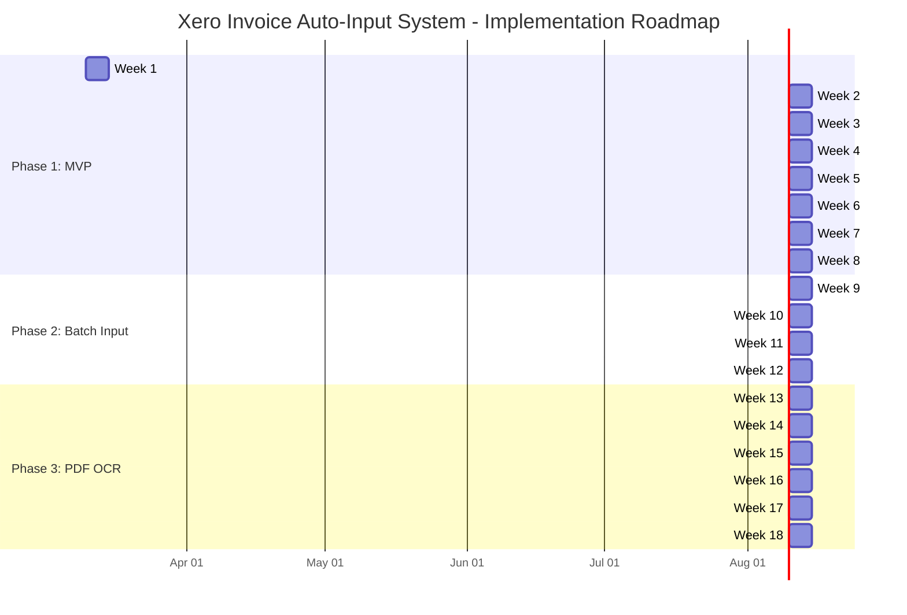

# Implementation Plan - Xero Invoice Auto-Input System

**Date:** 2026-03-10
**Version:** 1.0

---

## Overview

Three phases aligned to increasing capability and complexity:

| Phase | Scope | Duration | MVP Deliverable |
|-------|-------|----------|----------------|
| Phase 1 | OAuth2 + single invoice input + auto-complete + Xero submission | 8 weeks | Staff can input 5 fields and create a Xero invoice |
| Phase 2 | Batch input (paste multiple rows) + improved matching | 4 weeks | Staff can paste a repair list and submit multiple invoices at once |
| Phase 3 | PDF/image upload with OCR extraction | 6 weeks | Staff uploads a scanned repair list; system extracts and auto-fills rows |

---

## Phase 1: MVP (Weeks 1-8)

### Goal
A working web application where staff inputs 5 fields, receives auto-completed suggestions from historical data, reviews a full invoice preview, and submits to Xero.

### Tasks

#### Week 1: Project Setup and Database Foundation

| # | Task | Effort | Dependency |
|---|------|--------|-----------|
| 1.1 | Scaffold Next.js 15.2.3+ project (TypeScript strict, App Router, Tailwind, shadcn/ui) | 0.5 day | None |
| 1.2 | Install and configure Drizzle ORM + better-sqlite3; write schema.ts (all 6 tables) | 1 day | 1.1 |
| 1.3 | Write and run Drizzle migrations; verify SQLite file created | 0.5 day | 1.2 |
| 1.4 | Import 18,860 historical invoice rows from CSV files into invoice_history table | 1 day | 1.3 |
| 1.5 | Configure next.config.ts: serverExternalPackages for xero-node + better-sqlite3 | 0.5 day | 1.1 |
| 1.6 | Set up environment variables (.env.local template): XERO_CLIENT_ID, XERO_CLIENT_SECRET, ENCRYPTION_KEY, NEXTAUTH_SECRET, NEXTAUTH_URL | 0.5 day | 1.1 |

#### Week 2: OAuth2 Authentication

| # | Task | Effort | Dependency |
|---|------|--------|-----------|
| 2.1 | Create Xero app in Xero Developer Portal; configure redirect URI | 0.5 day | None |
| 2.2 | Install Auth.js v5 (next-auth@5); configure custom Xero OIDC provider in auth.ts (issuer: identity.xero.com, scopes: openid profile email offline_access accounting.transactions accounting.contacts accounting.settings) | 1 day | 1.6 |
| 2.3 | Implement Auth.js JWT callback: store access_token, refresh_token, expires_at in token | 1 day | 2.2 |
| 2.4 | Implement AES-256-GCM encrypt/decrypt in lib/xero/encrypt.ts (node:crypto, key from ENCRYPTION_KEY env) | 0.5 day | 1.6 |
| 2.5 | Implement token persistence: after successful auth, save encrypted token set to SQLite xero_tokens table | 1 day | 2.3, 2.4, 1.3 |
| 2.6 | Implement GET /api/xero/connections route: after auth, call Xero /connections to get tenantId; save to xero_tokens | 1 day | 2.5 |
| 2.7 | Build Login page (/login): "Connect to Xero" button triggering Auth.js signIn | 0.5 day | 2.2 |
| 2.8 | Add auth guard middleware: redirect unauthenticated requests to /login | 0.5 day | 2.7 |

#### Week 3: Token Manager and Xero Service

| # | Task | Effort | Dependency |
|---|------|--------|-----------|
| 3.1 | Implement TokenManager class (lib/xero/token-manager.ts): proactive refresh (5-min buffer), mutex lock using async-mutex package to prevent concurrent refresh race conditions | 1.5 days | 2.5 |
| 3.2 | Implement XeroClient singleton (lib/xero/client.ts): initialize xero-node XeroClient with tokenSet; call setTokenSet before each API call | 1 day | 3.1 |
| 3.3 | Implement XeroService (lib/xero/xero-service.ts): createInvoice(), getContacts(), getAccountCodes(), getTrackingCategories(); wrap with rate limit queue (p-queue, max 50/min, 5 concurrent) | 1.5 days | 3.2 |
| 3.4 | Implement GET /api/xero/health route: check token validity, return rate limit status | 0.5 day | 3.1 |
| 3.5 | Implement exponential backoff retry wrapper: catch HTTP 429, wait 1/2/4/8/16 seconds, max 5 retries | 0.5 day | 3.3 |

#### Week 4: Match Engine and Cache Layer

| # | Task | Effort | Dependency |
|---|------|--------|-----------|
| 4.1 | Install Fuse.js; implement MatchEngine (lib/match/engine.ts): load invoice_history into Fuse.js index with weights: project=2.0, unitNo=1.5, description=1.0 | 1 day | 1.4 |
| 4.2 | Implement ContactResolver (lib/match/contact-resolver.ts): parse Xero contact name format "{Project} {Unit} (O){Owner}" into structured fields | 1 day | None |
| 4.3 | Implement CacheManager (lib/cache/memory-cache.ts): in-memory Maps for contacts (1h TTL), accountCodes (24h TTL), trackingCategories (24h TTL) | 1 day | None |
| 4.4 | Implement cache warm-up (lib/cache/warm-up.ts): load contacts_cache from SQLite into memory Map + rebuild Fuse.js index; called from instrumentation.ts | 0.5 day | 4.1, 4.3 |
| 4.5 | Implement syncContactsCacheAction (app/actions/sync.ts): fetch contacts from Xero API, parse project/unit/owner, upsert into contacts_cache table and memory Map | 1 day | 4.2, 4.3, 3.3 |
| 4.6 | Implement fuzzyMatchAction (app/actions/match.ts): accept {project, unitNo, detail}; run Fuse.js search; return top 5 MatchSuggestion objects with all auto-filled fields | 1 day | 4.1, 4.5 |

**MatchSuggestion shape:**
```typescript
type MatchSuggestion = {
  score: number;
  contactId: string;
  contactName: string;
  accountCode: string;
  taxType: string;
  trackingOption1: string;
  trackingOption2: string;
  description: string;
  reference: string;
  invoiceType: string;
};
```

#### Week 5: Invoice Creation Logic

| # | Task | Effort | Dependency |
|---|------|--------|-----------|
| 5.1 | Implement createInvoiceAction (app/actions/invoice.ts): accept InvoiceFormData, validate with Zod schema, call XeroService.createInvoice(), save to created_invoices table | 2 days | 3.3, 1.3 |
| 5.2 | Map InvoiceFormData to Xero Invoice API payload: ACCREC type, LineItems array, Tracking array with Name+Option strings (not ID), LineAmountTypes=Exclusive, Status=DRAFT | 1 day | 5.1 |
| 5.3 | Implement graceful degradation: if Xero unreachable, save to created_invoices with status="PENDING_XERO"; add background retry check every 5 minutes | 1 day | 5.1 |
| 5.4 | Write Zod validation schema for InvoiceFormData (all 16 fields, with Malaysian business rules: MYR currency, Tax Exempt tax type, date format D/MM/YYYY) | 0.5 day | None |

#### Week 6: UI - Input Form and Preview

| # | Task | Effort | Dependency |
|---|------|--------|-----------|
| 6.1 | Build InvoiceForm component (app/components/InvoiceForm.tsx): 5-field inputs (Date, Project, Unit No, Detail, Final Price); debounced onChange triggers fuzzyMatchAction (300ms) | 1.5 days | 4.6 |
| 6.2 | Build SuggestionList component: display top 5 match suggestions with project/unit/contact preview; click to select and auto-fill all fields | 1 day | 6.1 |
| 6.3 | Build InvoicePreview component: show all 16 fields; editable fields for last-minute correction; clearly distinguish "auto-filled" vs "staff-modified" fields | 1.5 days | 6.1 |
| 6.4 | Build StatusToast component: success (InvoiceID + link to Xero), error (actionable message), loading spinner | 0.5 day | None |
| 6.5 | Build main page layout: login state detection, Invoice Form + Preview side-by-side, submit button | 1 day | 6.1, 6.2, 6.3 |

#### Week 7: Integration Testing and Bug Fixes

| # | Task | Effort | Dependency |
|---|------|--------|-----------|
| 7.1 | End-to-end test: full OAuth2 flow (auth → connections → token storage) with a real Xero sandbox account | 1 day | Week 2 complete |
| 7.2 | End-to-end test: fuzzy match returns correct suggestions for 20 real historical invoice patterns | 1 day | Week 4 complete |
| 7.3 | End-to-end test: invoice creation submits to Xero sandbox, returns InvoiceID, appears in Xero dashboard | 1 day | Week 5 complete |
| 7.4 | Test rate limit handling: verify exponential backoff on 429 responses | 0.5 day | Week 3 complete |
| 7.5 | Test token refresh: manually expire access token in DB, verify proactive refresh before next API call | 0.5 day | Week 3 complete |
| 7.6 | Test graceful degradation: block Xero API, verify invoice saved locally with PENDING_XERO status | 0.5 day | Week 5 complete |
| 7.7 | Cross-browser testing (Chrome, Safari, Edge) | 0.5 day | Week 6 complete |

#### Week 8: Polish, Documentation, and Deploy

| # | Task | Effort | Dependency |
|---|------|--------|-----------|
| 8.1 | Add error boundary components for React rendering errors | 0.5 day | None |
| 8.2 | Add loading skeletons for autocomplete and preview | 0.5 day | None |
| 8.3 | Mobile-responsive layout (Tailwind breakpoints: sm, md) | 0.5 day | Week 6 |
| 8.4 | Write user guide: how to connect Xero, how to use the form | 0.5 day | None |
| 8.5 | Set up local production deployment (PM2 or Docker Compose for internal LAN access) | 1 day | All above |
| 8.6 | Run final smoke test on production environment with real Xero account | 0.5 day | 8.5 |
| 8.7 | Staff onboarding: walk staff through 3 invoice creation examples | 1 day | 8.5 |

**Phase 1 Total Effort:** ~38 person-days

### Phase 1 Success Criteria
- Staff can log in via Xero OAuth2 in under 30 seconds.
- Entering Project + Unit No + Detail returns at least 3 relevant suggestions within 500ms.
- Invoice created in Xero within 5 seconds of submission.
- Zero incorrect invoice submissions in first 2 weeks of production use (audit via created_invoices log).
- System handles token expiry transparently (no manual re-auth within 8 hours of use).

---

## Phase 2: Batch Input (Weeks 9-12)

### Goal
Staff pastes multiple rows from a repair list (Excel/CSV format) into the system. All rows are fuzzy-matched simultaneously. Staff reviews and corrects the batch. All invoices are submitted in a single batch API call to Xero (up to 50 per request).

### Tasks

| # | Task | Effort | Dependency |
|---|------|--------|-----------|
| 2-1 | Design batch input data format: tab-delimited or CSV paste from Excel (Date, Project, Unit No, Detail, Final Price columns) | 1 day | Phase 1 complete |
| 2-2 | Build BatchInputForm component: textarea for paste, parse rows on input, validate row count and column structure | 2 days | 2-1 |
| 2-3 | Build BatchMatchAction (app/actions/batch-match.ts): run fuzzyMatchAction for all rows in parallel (Promise.all), return array of MatchSuggestion[] | 1 day | Phase 1 fuzzyMatchAction |
| 2-4 | Build BatchPreviewTable: spreadsheet-like editable table showing all rows with auto-filled columns; inline editing for corrections; row-level error indicators | 3 days | 2-3 |
| 2-5 | Implement batch invoice creation: split rows into chunks of 50; call Xero PUT /Invoices in sequence; show progress bar | 2 days | Phase 1 XeroService |
| 2-6 | Implement partial success handling: if some invoices fail in a batch, mark failed rows in BatchPreviewTable and allow retry | 1 day | 2-5 |
| 2-7 | Add batch history view: list of recent batch submissions with row count, success/fail, timestamp | 1 day | 2-5 |
| 2-8 | Improve Fuse.js matching: after Phase 1 production data, re-weight fields based on observed match accuracy; add exact-match fast path for known project+unit combinations | 1 day | Phase 1 production data |
| 2-9 | Integration tests for batch flow: 10, 50, 51 rows (tests chunking logic) | 1 day | 2-5 |

**Phase 2 Total Effort:** ~13 person-days

### Phase 2 Success Criteria
- Paste 20 rows from Excel → all rows matched and previewed within 2 seconds.
- Submit 50 invoices to Xero in a single batch in under 10 seconds.
- Partial failure correctly highlights failed rows without losing successful ones.

---

## Phase 3: PDF/Image Upload with OCR (Weeks 13-18)

### Goal
Staff uploads a scanned repair list (PDF or photo). OCR extracts text, the system parses it into rows, and auto-fills the batch input form. Reduces manual data entry to zero for structured repair lists.

### Tasks

| # | Task | Effort | Dependency |
|---|------|--------|-----------|
| 3-1 | Evaluate OCR options: (A) Google Cloud Vision API, (B) Tesseract.js (local), (C) Azure Document Intelligence. Recommend: Google Cloud Vision (best accuracy for mixed Japanese/English text common in this company's documents) | 2 days | None |
| 3-2 | Implement file upload endpoint (app/api/ocr/upload/route.ts): accept PDF/PNG/JPG, max 10MB, save temporarily | 1 day | None |
| 3-3 | Implement OCR service (lib/ocr/ocr-service.ts): send image to chosen OCR API, receive raw text | 2 days | 3-1, 3-2 |
| 3-4 | Implement repair list parser (lib/ocr/repair-list-parser.ts): parse raw OCR text into structured rows using heuristic patterns (amount detection, date detection, project name matching against known tracking options list) | 4 days | 3-3 |
| 3-5 | Build UploadForm component: drag-and-drop PDF/image, upload progress, OCR processing spinner | 2 days | 3-2 |
| 3-6 | Connect OCR output to Phase 2 BatchPreviewTable: auto-populate rows from parsed OCR results | 1 day | 3-4, Phase 2 BatchPreviewTable |
| 3-7 | Implement manual correction UI: side-by-side view of original document image (left) and parsed data table (right) for easy correction | 2 days | 3-6 |
| 3-8 | Build OCR accuracy feedback loop: after staff submits, record OCR-parsed vs staff-corrected values in new ocr_feedback table; use to improve parser patterns | 2 days | 3-6 |
| 3-9 | Integration tests: 5 real scanned repair list samples | 1 day | 3-7 |
| 3-10 | Staff training on document quality guidelines (minimum resolution, avoid handwriting) | 0.5 day | 3-9 |

**Phase 3 Total Effort:** ~17.5 person-days

### Phase 3 Success Criteria
- OCR correctly extracts at least 80% of rows from standard printed repair lists without correction.
- Parsing step completes within 10 seconds per page.
- Staff time per invoice batch reduced from Phase 2 baseline by at least 50%.

---

## Mermaid Gantt Chart



---

## Dependencies Map

```
Phase 1 (Weeks 1-8)
  └── SQLite DB (Week 1) ──────────────────────┐
  └── OAuth2 / Auth.js (Week 2) ────────────── │
  └── Token Manager + XeroService (Week 3) ─── │──→ Invoice Creation (Week 5)
  └── MatchEngine + Cache (Week 4) ──────────── │──→ Invoice Creation (Week 5)
  └── Zod Validation (Week 5) ───────────────── │
  └── UI (Week 6) ───────────────────────────── │
  └── Testing (Week 7) ──────────────────────── │
  └── Deploy (Week 8) ◄──────────────────────── ┘

Phase 2 (Weeks 9-12)
  └── Requires: Phase 1 complete (MVP in production)
  └── Requires: At least 2 weeks production data for matching improvement (Week 8-9 gap)

Phase 3 (Weeks 13-18)
  └── Requires: Phase 2 BatchPreviewTable (Week 11)
  └── Requires: OCR API key/account setup (external dependency, order in Week 12)
```

---

## Technology Stack Summary

| Layer | Technology | Version | Notes |
|-------|-----------|---------|-------|
| Framework | Next.js | >= 15.2.3 | Must be this version or higher (CVE-2025-29927) |
| Language | TypeScript | 5.x strict | Strict mode enabled |
| UI | Tailwind CSS + shadcn/ui | Latest | |
| Forms | React Hook Form + Zod | Latest | |
| Auth | Auth.js (next-auth) | v5.x | Custom Xero OIDC provider |
| Xero SDK | xero-node | 14.0.0 | Server-side only |
| ORM | Drizzle ORM | Latest | |
| Database driver | better-sqlite3 | Latest | |
| Fuzzy search | Fuse.js | Latest | |
| Concurrency | async-mutex | Latest | Token refresh mutex |
| Queue | p-queue | Latest | Xero API rate limiting |
| Token encryption | node:crypto | Built-in | AES-256-GCM |
| Phase 3 OCR | Google Cloud Vision API | v1 | TBD in Phase 3 evaluation |
